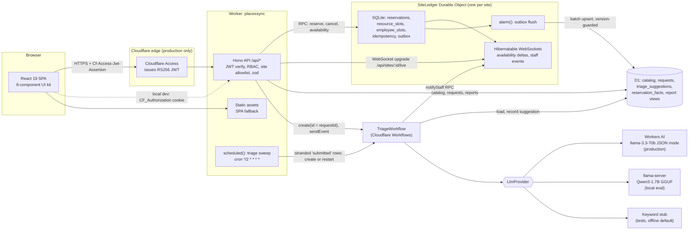

# PlacesSync

A workplace application for reserving desks and meeting rooms, reporting facilities issues, and following each request until it is resolved. One Cloudflare Durable Object per site is the only writer of reservations and commits every booking in a single SQLite transaction, live availability reaches browsers over hibernatable WebSockets, reporting runs on D1, and a Cloudflare Workflow suggests one of four service categories for each facilities request so staff can accept or change it.

Everything in this repository runs and is tested locally on workerd (through Miniflare and the Cloudflare Vite plugin). Nothing here has been deployed, and no number below comes from Cloudflare's production services. See [What runs where](#what-runs-where).

## Why

A workplace team shares a fixed set of desks and rooms across many employees. As the office fills up, two requests race for the same desk, booking screens show availability that changed seconds ago, and facilities issues land in one inbox where someone has to read and route each one. PlacesSync treats a booking as a write to a per-site ledger that cannot double-book, pushes each committed change to every screen watching that date, and has a model suggest the service category for each issue while the decision stays with facilities staff.

## What it does

- **Find a space.** Search 20 resources (14 desks, 6 rooms) by date, time window, kind, floor, amenities, seats and free text; pick a range on a slot grid that updates live; confirm in a dialog.
- **Resource calendars.** A week view per desk or room, bookable from the grid.
- **My bookings.** Upcoming, past and cancelled bookings; cancel with an optional reason.
- **Report an issue and follow it.** Submit a facilities request; see its status, the suggested category with the provider that produced it, the final category, and a timeline.
- **Facilities staff.** A triage queue with suggestions, confidence and provider labels; accept, reassign, or categorize by hand; move work to in progress and resolved; today's bookings with names; live notifications.
- **Facilities admins.** Utilization, hourly occupancy and bookings per day from D1 reporting views; request reports with suggestion agreement shown per provider; activate, deactivate and edit resources (the ledger's catalog copy resyncs at once).
- **Synthetic data.** 100 employees (92 employees, 6 facilities staff, 2 facilities admins) and the 20 resources come from seeded generators whose output is pinned by SHA-256 in tests.

## Architecture



How a booking is kept safe:

1. The Worker verifies the token, loads the employee and role from D1, validates the body with zod, and resolves the site from the D1 resource row (404 before any Durable Object call). Durable Object names never come from a request: `ledgerFor` allows only the configured site, and a test fails if `getByName(` appears anywhere else.
2. The `SiteLedger` loads its catalog once (single-flight), then runs one `transactionSync` with no `await` inside: idempotency lookup, the shared booking rules, an overlap `SELECT` on the resource, an overlap `SELECT` on the employee, the reservation insert, one `resource_slots` and one `employee_slots` row per 15-minute slot under PRIMARY KEYs, the ledger and per-date version bumps, an outbox row and the idempotency record. A duplicate slot throws and rolls everything back.
3. After commit the object sends a delta to sockets subscribed to that date and arms its alarm, which copies outbox rows to D1 with upserts guarded by version.

Design decisions are recorded in [`docs/adr/`](docs/adr) (one ledger per site, slot claims, the outbox, explicit Access verification, the Vitest integration, the Workflow, per-date live versions, the triage sweep). The domain vocabulary is in [`CONTEXT.md`](CONTEXT.md). The full design is [`SPEC.md`](SPEC.md).

## What runs where

| Capability | Local (this Mac and CI) | Production (after deploy) |
|---|---|---|
| Worker and Hono API | workerd via `vite dev` / `vite preview`; tests via `@cloudflare/vitest-plugin` | Cloudflare Workers |
| Static SPA | Vite build served by local workerd assets | Workers static assets |
| SiteLedger (DO SQLite, transactions, alarms, WebSocket hibernation) | Miniflare local Durable Objects, persisted in `.wrangler/state/v3` | Durable Objects (SQLite backend). Alarms may be delayed up to a minute in production, so D1 reports lag more than locally. |
| D1 | local SQLite via Miniflare | D1 database `placessync` |
| Workflows | local emulated engine (Cloudflare's docs say local behaviour may differ; the local "already exists" and "not found" error texts are Miniflare's) | Cloudflare Workflows |
| Cron triage sweep | `scheduled()` called directly in tests via `createScheduledController`; not fired on a timer during local dev | Cron Trigger `*/2 * * * *` on `placessync-production` |
| Triage LLM | `stub` (keyword-v1, not an LLM) by default and always in `npm test`; `openai-compat` against llama-server with Qwen3-1.7B Q4_0 (8,192 tokens per slot, 1 slot) for evals; seeded suggestions are stub output and labeled so | Workers AI `@cf/meta/llama-3.3-70b-instruct-fp8-fast`, optional AI Gateway |
| Auth | `jose` verifying RS256 tokens signed by a locally generated dev key; dev login page; cookie or header | Cloudflare Access; JWKS from `https://<team>.cloudflareaccess.com/cdn-cgi/access/certs`; header only |
| Contention eval | local workerd, single machine, numbers labeled local | not run (would need an Access service token); none claimed |
| Triage eval | Qwen3-1.7B via llama.cpp, labeled with the model | not run; no Workers AI accuracy is claimed |
| PITR, location hints, AI Gateway analytics | unavailable | available, unused in v1 |

No local stand-in is the production service. In particular:

- **Access is simulated locally.** The dev login signs a token with a key generated on this machine; the same verifier then checks it. Tests also run the production code path against a fake team JWKS. This proves the verifier's checks, not Cloudflare's login flow.
- **The keyword stub is not an LLM.** It is the default provider offline and in every test, and the UI labels it "Keyword stub (keyword-v1)". The word "AI" appears only next to Workers AI suggestions.
- **Workers AI has not run.** The provider is tested against a fake binding. The only model numbers below are from Qwen3-1.7B on a local llama.cpp server.
- **Workflows, Durable Objects, D1 and cron are Miniflare's local implementations.**

## Run it locally

Requirements: Node 22.22 or later (CI uses 24), npm 11. No Cloudflare account is needed.

```sh
npm ci
npm run setup:dev          # writes .dev.vars with a fresh RS256 dev key (gitignored)
npm run build              # vite build copies .dev.vars into dist; rebuild after changing it
npm run db:migrate:local   # applies migrations/ to local D1
npm run preview            # http://localhost:8783
npm run seed:local         # in another terminal: 100 employees, 20 resources, 40 demo requests
npm run seed:local -- --history   # optional: also 20 business days of past bookings for the admin reports
```

Open http://localhost:8783, pick a user on the dev sign-in page (admins and staff are listed first), and book. `npm run dev` runs the Vite dev server on the same port.

To use the local LLM for triage in the app, put `TRIAGE_PROVIDER=openai-compat` in `.dev.vars`, run `npm run llm:serve` (llama-server on port 8130 with `~/Developer/projects/_models/Qwen3-1.7B-Q4_0-rtn.gguf`), and rebuild before `npm run preview`.

## Tests

```sh
npm run types:check   # generated runtime types are current
npm run typecheck     # tsc -b over app, worker and node projects (TypeScript 7)
npm test              # Vitest: worker, worker-ws, ui (jsdom), node
npm run test:e2e      # Playwright (Chromium) against npm run preview
```

- **worker** runs inside workerd with the real Durable Object, D1 and Workflows bindings: booking rules, the ledger's transactions and rollback, idempotency, cancellation, the outbox and its failure backoff, reports, auth in dev and access modes, the role matrix, the site allowlist, the triage workflow with forced step failures and timeouts, the cron sweep, and a test that fires all 1,000 generated attempts through the Worker at once.
- **worker-ws** holds every test that opens a WebSocket (one worker, no storage isolation, as Cloudflare recommends): per-date deltas, the cross-date case, hibernation, expiry, staff events.
- **ui** tests each of the eight components for its keyboard contract and with axe, and each page against a fetch fake and a fake WebSocket.
- **node** checks the README results block, the `getByName` guard, generator hashes in Node, eval math, and the hard triage set.

The Workers Vitest integration is `@cloudflare/vitest-plugin` (formerly `@cloudflare/vitest-pool-workers`, which npm marks deprecated and which cannot start with this compatibility date; see [ADR 0005](docs/adr/0005-vitest-plugin.md)).

## Evals

How each eval runs and what each metric means is in [`evals/README.md`](evals/README.md). In short:

- **Contention:** 1,000 generated reservation attempts (700 on one date, 300 on the next, by all 100 employees over all 20 resources, at least 900 of them contested) fired at once at a running local server, with live observers on both dates and a deliberately unsafe read-then-write D1 booker as a negative control that must produce overlaps.
- **Triage:** 200 templated requests and 40 deliberately ambiguous ones classified into the four categories, with the keyword baseline beside every model number. The 40 were written during the build with AI assistance (not by facilities staff) and labeled per [`evals/triage-labeling-guide.md`](evals/triage-labeling-guide.md).

## Results

This block is generated by `npm run results` from the committed `evals/results/*.json`. The command refuses files produced on a dirty tree or at a commit that is not an ancestor of `HEAD`, and a test fails if this block differs from its output. All numbers are from local runs on one machine.

<!-- results:start -->
### Reservation contention (local workerd)

Command: `node scripts/eval-contention.ts --base-url http://localhost:8783 --runs 5 --observers 4 --control naive-d1 --out evals/results/contention.json`. Run 2026-10-08 at commit `a5b243c` on Apple M5 (Darwin 25.5.0 arm64, Node v25.9.0).

| Metric | Value |
|---|---|
| Runs | 5 |
| Attempts per run (date A / date B) | 1,000 (700 / 300) |
| Attempts overlapping another attempt (generator) | 984 |
| Accepted | 133 to 143 |
| Rejected: resource conflict / employee conflict | 853 to 861 / 3 to 7 |
| **Overlapping confirmed bookings** | **0** |
| Employee double bookings | 0 |
| Unjustified rejections, phantom or lost acceptances | 0, 0, 0 |
| Validation errors, server errors | 0, 0 |
| D1 projection mismatches | 0 |
| Live observers: date-version gaps, foreign-date messages, final-state mismatches | 0, 0, 0 |
| Slot-key backstop activations | 0 |
| Transport retries (refused connects or dev-proxy failures, resent with the same Idempotency-Key) | 0 to 59 |
| Negative control (naive read-then-write D1): accepted, overlapping pairs | 305, 575 |
| Latency p50 / p95 / p99, run 1 (local, single machine) | 1416.2 / 2548.3 / 2610.2 ms |

All gates in SPEC 13.1 passed.

### Triage classification: qwen3-1.7b (Qwen3-1.7B-Q4_0-rtn.gguf, llama.cpp, 8192 tokens per slot)

Command: `node scripts/eval-triage.ts --provider openai-compat --base-url http://127.0.0.1:8130/v1 --model qwen3-1.7b --set all --out evals/results/triage-qwen3-1.7b.json`. Run 2026-10-08 at commit `a5b243c` on Apple M5 (Darwin 25.5.0 arm64, Node v25.9.0).

| Set | Items | Accuracy | Macro-F1 | Schema-valid first try | Keyword fallback | Latency p50 / p95 | Keyword baseline accuracy |
|---|---|---|---|---|---|---|---|
| templated | 200 | 84.0% | 0.845 | 100.0% | 0.0% | 771.9 / 1025.6 ms | 87.0% |
| hard | 40 | 77.5% | 0.787 | 100.0% | 0.0% | 788.6 / 1048.7 ms | 65.0% |

Source file: `evals/results/triage-qwen3-1.7b.json`.

### Triage classification: Keyword stub (keyword-v1), not an LLM

Command: `node scripts/eval-triage.ts --provider stub --set all --out evals/results/triage-keyword.json`. Run 2026-10-08 at commit `a5b243c` on Apple M5 (Darwin 25.5.0 arm64, Node v25.9.0).

| Set | Items | Accuracy | Macro-F1 | Schema-valid first try | Keyword fallback | Latency p50 / p95 | Keyword baseline accuracy |
|---|---|---|---|---|---|---|---|
| templated | 200 | 87.0% | 0.874 | 100.0% | 0.0% | 0.2 / 0.4 ms | 87.0% |
| hard | 40 | 65.0% | 0.645 | 100.0% | 0.0% | 0.1 / 0.3 ms | 65.0% |

Source file: `evals/results/triage-keyword.json`.

### Triage through the Workflow (local server, Qwen3-1.7B via llama.cpp)

Command: `node scripts/eval-triage.ts --mode workflow --app-url http://localhost:8783 --n 20 --base-url http://127.0.0.1:8130/v1 --model qwen3-1.7b --out evals/results/triage-workflow-local.json`. Run 2026-10-08 at commit `a5b243c` on Apple M5 (Darwin 25.5.0 arm64, Node v25.9.0).

| Metric | Value |
|---|---|
| Requests submitted through the API | 20 |
| Reached awaiting_review with a suggestion | 20 |
| Suggestion providers | openai-compat: 20 |
| Category inside the four-category enum | 20 |
| Suggestion equals the template label | 90.0% |
| Submit to awaiting_review, p50 / p95 (local) | 941 / 1095.9 ms |

### End-to-end checks (Playwright, Chromium)

Command: `npm run test:e2e`. Run 2026-10-08 at commit `a5b243c` on Apple M5 (Darwin 25.5.0 arm64, Node v25.9.0).

| Metric | Value |
|---|---|
| Tests passed | 53 of 53 |
| axe scans (WCAG 2.0 A/AA, 2.1 AA, 2.2 AA) and violations | 32 scans, 0 violations |
| Layout checks at 375x812 and 768x1024 and failures | 20 checks, 0 failures |
| Keyboard-only booking and cancellation | passed |
| Live update propagation, 20 bookings, p50 / p95 (local Chromium, booking request to busy cell in a second browser) | 12 / 13 ms |
<!-- results:end -->

## Deploy (not done yet)

Nothing has been deployed from this repository. The steps, for an account holder:

1. `npx wrangler login`
2. `npx wrangler d1 create placessync` and paste the `database_id` into `env.production.d1_databases[0]` in `wrangler.jsonc`.
3. In Zero Trust, create a self-hosted Access application for `placessync-production.<account-subdomain>.workers.dev` (the `production` environment suffix is part of the Worker name). Copy the Application Audience tag and the team domain into `ACCESS_AUD` and `ACCESS_TEAM_DOMAIN`, replacing the `SET_ME` placeholders. Until then every API route answers 500 `misconfigured` by design.
4. Optional: create an AI Gateway and set `AI_GATEWAY_ID`.
5. `npx wrangler d1 migrations apply DB --remote -c wrangler.jsonc --env production`
6. `mkdir -p .seed && node scripts/export-catalog-sql.ts --admin-email <your-email> > .seed/catalog.sql`, then `npx wrangler d1 execute DB --remote -c wrangler.jsonc --env production --file .seed/catalog.sql`. `.seed/` is gitignored.
7. `npm run deploy` (rebuilds with `CLOUDFLARE_ENV=production`, then `wrangler deploy`).
8. Through Access: book a desk, watch the live update in a second browser, submit a facilities request, and confirm a `triage_suggestions` row with `provider = 'workers-ai'`. Check that the Cron Triggers tab shows `*/2 * * * *`.

## Known gaps

- **Figma:** no Figma file exists; the UI kit follows the design tokens in `src/client/ui/tokens.css` and the contracts in SPEC 14.2. See [`design/FIGMA.md`](design/FIGMA.md).
- **Accessibility evidence is automated:** axe on every page and component state at two viewports, component keyboard tests, and a keyboard-only booking path. No manual screen-reader pass has been done.
- **Mobile layouts** are checked in Chromium emulation at 375x812 and 768x1024, not on devices.
- **Single ledger per site** is a throughput ceiling by design (ADR 0001); v1 has one site.
- **Role changes** take effect on open WebSockets no later than token expiry (8 hours for dev tokens; the Access session length in production); v1 has no role-change API.
- **Rate limiting** is not implemented (a production follow-up using the Workers rate limiting binding).

## License

MIT. Copyright (c) 2026 Nitish Chowdary.
