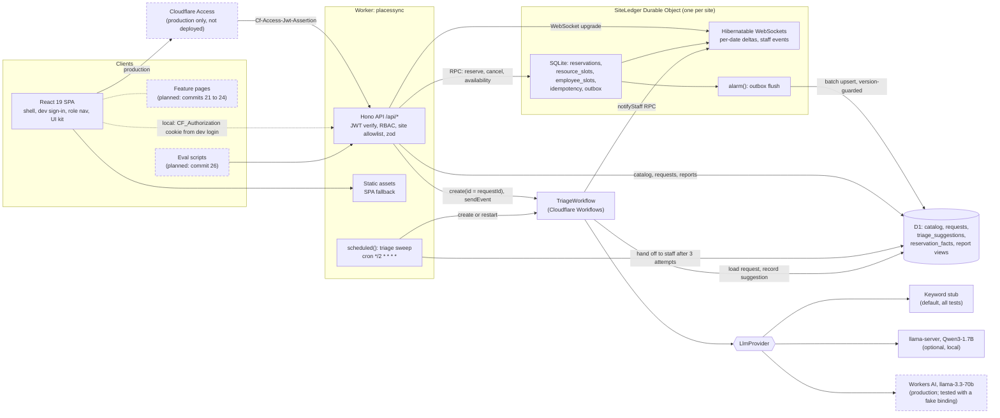
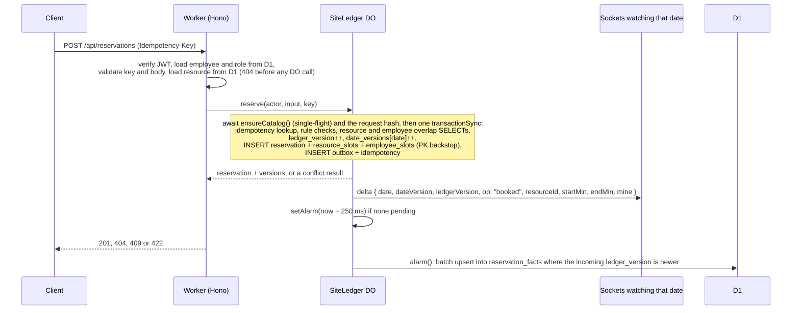

# PlacesSync

Desk and meeting-room booking on Cloudflare Workers: one Durable Object per site commits every booking in a single SQLite transaction, clients watching a date receive availability changes over hibernatable WebSockets, and a Cloudflare Workflow suggests a service category for each facilities request before staff review it.

> **v1 is in active development. Nothing is deployed.** The server side (reservation ledger, live updates, reporting projection, auth, triage workflow and its cron sweep) is built and tested through the HTTP API. In the browser, the app shell, dev sign-in and role-based navigation work; the booking, request and dashboard pages still render only their headings. All people, departments and systems in this repo are synthetic. [PROGRESS.md](PROGRESS.md) is the live build log and is always more current than this page.

## Why

A workplace (People and Places) team shares a fixed set of desks and rooms across many employees. Three things go wrong as the office fills up:

- Two people end up holding the same desk because two requests raced each other.
- The booking screen shows availability that changed seconds ago.
- Facilities issues ("the projector in Sequoia keeps dropping HDMI") arrive in one inbox, and someone has to read each one and route it to the right team.

PlacesSync treats a booking as a write to a per-site ledger that cannot double-book, pushes each committed change to every client watching that date, and has a model suggest the service category for each issue while the decision stays with facilities staff.

## Status

| | |
|---|---|
| Build plan | Commit 20 of 32 complete at `41a6d1d` (app shell, routing, session, dev sign-in, role-based navigation). Next: commit 21, Find a space with live availability. [PROGRESS.md](PROGRESS.md) has the live position. |
| Tests | **421 passing in 42 files**: `npm test` run on a clean export of commit `41a6d1d`, 2026-10-08, about 14 s. |
| Other checks | `npm run typecheck`, `npm run types:check` and `npm run build` pass on the same export. CI runs all four on every push and pull request. |
| Deployed | No. Deploying needs a Cloudflare login (see [Local versus production](#local-versus-production)). |
| Eval results | None yet. The eval scripts are planned; no number in this README is a benchmark. |

**Works today** (server features through the HTTP API; everything below is covered by tests)

- Resource search, availability, week calendars, booking, cancellation and "my bookings" for the 20 synthetic resources at one site.
- Conflict-safe booking in the `SiteLedger` Durable Object, with idempotency keys and per-employee rules (one desk and one room at a time).
- Live availability over hibernatable WebSockets, subscribed per date, with session expiry.
- A transactional outbox that projects reservations into D1 reporting tables, plus admin report routes.
- Facilities requests, the `TriageWorkflow`, conditional staff review, and a cron sweep that restarts stuck triage and hands a request to staff after 3 attempts, so no request stays in `submitted`.
- Cloudflare Access JWT verification, a local dev login backed by a generated RS256 key, three roles, and fail-closed config.
- A test that fires the 1,000 generated booking attempts concurrently through the Worker and asserts zero overlapping bookings, zero employee double bookings, a D1 projection equal to the ledger, and zero backstop hits.
- All eight UI kit components (Button, TextField, Dialog, Combobox, Tabs, DataTable, DateGrid, SlotGrid) with keyboard and axe tests.
- The React app shell: a route for every page, session handling, role guards, the dev sign-in page and role-based navigation.

**Still to come**

- The feature pages: Find a space, resource calendar, My bookings, Report issue, My requests, request detail, Staff and Admin dashboards, and the component gallery. Their routes exist and render a heading only.
- Playwright end-to-end tests (mobile layout, keyboard-only booking, axe gate, realtime).
- The contention and triage eval scripts, and a generated Results section.
- The `seed:local` script (seed with `curl` until then, as shown below).
- `CONTEXT.md` and ADRs.
- A production deploy, which needs a Cloudflare login.

## Features

| Feature | Status | Where |
|---|---|---|
| Resource search by kind, floor, amenities, minimum capacity and free text | Implemented | `GET /api/sites/:siteId/resources` |
| Availability for a date: busy intervals, free windows, fit for a time window | Implemented | `GET /api/sites/:siteId/availability` |
| Seven-day booking calendar per resource (other employees' ids never exposed) | Implemented | `GET /api/resources/:resourceId/calendar` |
| Book a desk or room with an `Idempotency-Key`; 409 lists the conflicting intervals | Implemented | `POST /api/reservations` |
| Cancel (owner or admin, before the booking starts) and list own bookings | Implemented | `POST /api/reservations/:id/cancel`, `GET /api/reservations` |
| Live availability: per-date snapshots and deltas over hibernatable WebSockets | Implemented | `GET /api/sites/:siteId/live` |
| Live staff events (`triage_ready`, `triage_overdue`, `triage_unavailable`, `request_updated`) | Implemented | same socket, `subscribe_staff` |
| D1 reporting projection and utilization report | Implemented | `/api/admin/reports/utilization`, `/api/admin/reports/reservations` |
| Ledger export and projection health for admins | Implemented | `/api/admin/ledger/export`, `/api/admin/projection/status` |
| Report a facilities issue, list own requests, view detail, cancel | Implemented | `/api/requests` |
| Triage workflow: classify into one of four categories, record suggestion, notify staff, 24-hour review timer | Implemented | `src/worker/triage/triage-workflow.ts` |
| Cron sweep for requests stuck in `submitted` (create, restart, or hand to staff) | Implemented | `src/worker/triage/sweep.ts` |
| Staff review: accept, reassign, or categorize by hand; status changes | Implemented | `/api/staff/requests` |
| Request report: category summary, agreement per provider, median time to review | Implemented | `/api/admin/reports/requests` |
| Access JWT verification, dev login, role-based access for three roles | Implemented | `src/worker/auth/` |
| Deterministic synthetic data generators with SHA-256 pins | Implemented | `src/shared/synthetic/` |
| UI kit: Button, TextField, Dialog, Combobox, Tabs, DataTable, DateGrid, SlotGrid (keyboard and axe tests, layouts for widths under 640 px) | Implemented | `src/client/ui/` |
| App shell: router, session, role guards, dev sign-in page, role-based navigation (bottom bar under 640 px) | Implemented | `src/client/App.tsx`, `src/client/shell/`, `src/client/session/` |
| Pages: Find a space, resource calendar, My bookings, Report issue, My requests, request detail, Staff and Admin dashboards | Planned (routes render a heading) | commits 21 to 24 |
| Component gallery at `/ui` | Planned (route renders a heading) | SPEC 14 |
| End-to-end tests: mobile layout, keyboard booking, axe gate, realtime | Planned | commit 25 |
| Contention eval (1,000 attempts, WebSocket observers, unsafe D1 control) and triage classifier eval (local Qwen3-1.7B against a keyword baseline) | Planned | commit 26 |
| Staff "today's bookings", admin resource edits, history import and hourly occupancy, request timeline, table sorting | Planned (Tier 2) | commits 29 to 31 |
| Workflow-mode triage eval, realtime latency measurement, 5-run contention eval | Planned (Tier 2) | commit 32 |
| Production deploy with Workers AI and Cloudflare Access | Planned | needs a Cloudflare login |

## Architecture

Dashed boxes are planned or production-only; everything else exists and is tested locally.



### Reservation write path



## Key design decisions

The full reasoning is in [SPEC.md, Section 2](SPEC.md#2-architecture) and Sections 7 to 10. ADR files under `docs/adr/` are planned for the docs commit.

**One ledger per site, one transaction per booking.** `SiteLedger` is a SQLite-backed Durable Object addressed by site id. `reserve` awaits only the single-flight catalog load and a SHA-256 of the request, then runs one `transactionSync` with no `await` inside, so nothing interleaves between the overlap check and the insert. One object per site, not per resource, because "one desk per employee at a time" spans resources and has to be checked in the same transaction.

**Two independent barriers against double booking.** An overlap `SELECT` produces a useful 409 body with the conflicting intervals. Separately, every booking claims 15-minute rows in `resource_slots (resource_id, date, slot)` and `employee_slots (employee_id, kind, date, slot)` under primary keys. If the `SELECT` were ever wrong, the key violation rolls back the whole transaction, including the reservation row and both version bumps; a second transaction then counts the hit in `backstop_hits` and stores the 409 under the idempotency key. The 1,000-request contention test asserts zero overlapping confirmed bookings, zero employee double bookings, and zero backstop hits (the `SELECT` did the work).

**Idempotency inside the transaction.** Keys are scoped to `(employee_id, key)` and stored with a SHA-256 of the request. A retry with the same body replays the stored response byte for byte (tested); the same key with a different body returns 422 `idempotency_key_reuse`. Conflicts are returned as results rather than thrown, so the idempotency row commits with them. Rows older than 24 hours are purged by the alarm.

**Per-date live versions.** Each mutation bumps a global `ledger_version` and a `date_versions[date]` counter in the same transaction. Sockets subscribe to dates (up to 14), and deltas go only to sockets watching that date, so a client can detect a gap per date without a booking on another date forcing a resubscribe. Keepalive pings use the WebSocket auto-response, so they never wake the object. Every broadcast and every incoming message first checks the token expiry stored in the socket's attachment and closes an expired session with code 4001.

**Transactional outbox instead of a queue.** The reporting fact row is written to an outbox in the same transaction as the booking, which a post-commit `queue.send()` cannot guarantee. The alarm flushes up to 50 rows per run into D1 with upserts guarded by `ledger_version`, so replays and reordering are harmless. Failures are caught, counted, and retried with backoff of `min(2^n s, 60 s)`; rows are never dropped.

**Auth: verify Access tokens explicitly.** Production reads `Cf-Access-Jwt-Assertion` and verifies RS256, issuer, audience and expiry (30 s tolerance) with `jose` against the team's Access certs URL. Locally the same verifier runs against a generated RS256 key, and tests exercise the remote key-set path through an injected fetch. Roles come only from D1, looked up by the verified email; a `role` claim in the token is ignored (tested). Writes and WebSocket upgrades whose `Origin` header names another origin get 403.

**Fail closed.** `parseConfig` rejects unknown auth modes, the `SET_ME` placeholders in the production config and the `REPLACE_WITH` dev-key placeholders, so an unconfigured deploy answers 500 `misconfigured` instead of trusting anything. Dev mode only answers requests addressed to localhost. Durable Object names never come from a request: `ledgerFor()` checks the site allowlist and is the only call site of `getByName`, enforced by a test that scans the source tree.

**Pluggable triage provider.** `LlmProvider` has one method, `completeJson({ system, user, schema, maxTokens, temperature })`, which returns the model's text. Implementations: a deterministic keyword stub (default, and pinned in every test), an OpenAI-compatible client for a local llama-server, and a Workers AI client that uses JSON mode and an optional AI Gateway. Output is parsed with zod into exactly one of four categories; invalid output throws so the Workflow step retries, and after retries the keyword classifier answers and is recorded as `keyword-fallback`. One label map reserves "AI" for `workers-ai` rows, so stub and fallback output is never presented as AI.

**No request left stranded.** The Workflow instance id is the request id, so creating it twice is harmless. Steps are durable and retried; if classification fails, a fallback step runs; the review wait times out after 24 hours and flags the request as overdue if it is still unreviewed. A cron sweep every 2 minutes takes up to 25 requests still `submitted` after 2 minutes: it creates a missing workflow or restarts an errored one, and hands the request to staff for manual categorization after 3 attempts or when its workflow finished without recording a suggestion.

**Exactly one review.** Staff decisions are conditional `UPDATE`s guarded on the current status and triage state, so two staff members reviewing at once produce one review and one 409 `not_reviewable` (tested). A partial unique index allows only one `reviewed` event per request.

## Tech stack

Exact versions from `package.json`.

| Area | Packages |
|---|---|
| Runtime | Cloudflare Workers (`compatibility_date` 2026-10-01): Durable Objects (SQLite), D1, Workflows, Cron Triggers; Workers AI in the production config |
| API | `hono` 4.13.13, `@hono/zod-validator` 0.9.1, `zod` 4.6.5, `jose` 6.2.12 |
| Client | `react` and `react-dom` 19.3.0, `react-router` 8.4.0, CSS modules with design tokens |
| Build and dev | `vite` 8.3.4, `@vitejs/plugin-react` 6.1.2, `@cloudflare/vite-plugin` 1.63.1, `wrangler` 4.149.0, `typescript` 7.0.2 (`tsc -b`, strict, `noUncheckedIndexedAccess`) |
| Tests | `vitest` 4.1.11 with the Workers Vitest integration (`@cloudflare/vitest-plugin` 1.4.0, formerly `@cloudflare/vitest-pool-workers`), `jsdom` 30.1.2, `@testing-library/react` 16.3.3, `@testing-library/user-event` 14.6.7, `axe-core` 4.14.0 |
| End-to-end (installed, specs planned) | `@playwright/test` 1.63.0, `@axe-core/playwright` 4.13.0 |
| Node | 24 in CI (`.nvmrc`); `engines` requires >= 22.22 |

## Getting started

Everything runs offline. No Cloudflare account is needed.

```sh
npm ci
npm run setup:dev          # writes .dev.vars with a fresh RS256 dev key pair
npm run db:migrate:local   # applies migrations/ to the local D1 under .wrangler/state
npm run dev                # Vite + workerd at http://localhost:5173 (Vite's default port)
```

`.dev.vars.example` lists the two secret keys (`DEV_ACCESS_PRIVATE_JWK`, `DEV_ACCESS_JWKS`) with placeholder values. The config rejects those placeholders, so run `npm run setup:dev` rather than copying the example. `.dev.vars` is gitignored.

In a second terminal, seed the synthetic world through the dev-only endpoint:

```sh
B=http://localhost:5173
curl -s -X POST $B/api/dev/seed -H 'content-type: application/json' -d '{"reset": true}'
# {"employees":100,"resources":20,"historyReservations":0,"requests":40}
```

Open `http://localhost:5173/login` to sign in as any of the 100 synthetic users and see the navigation for that role. The feature pages are still headings, so drive the booking flow through the API. Log in as a synthetic employee and book a desk:

```sh
TOKEN=$(curl -s -X POST $B/api/dev/login -H 'content-type: application/json' \
  -d '{"employeeId":"emp_001"}' | node -pe 'JSON.parse(require("fs").readFileSync(0)).token')

curl -s $B/api/me -H "Cf-Access-Jwt-Assertion: $TOKEN"

# Desk 2A-01, 09:00 to 11:00 (minutes after midnight). DATE must be a weekday
# within the next 14 days; GET /api/health returns siteToday.
DATE=YYYY-MM-DD
curl -s -X POST $B/api/reservations -H "Cf-Access-Jwt-Assertion: $TOKEN" \
  -H 'Idempotency-Key: demo-booking-0001' -H 'content-type: application/json' \
  -d "{\"resourceId\":\"res_2a01\",\"date\":\"$DATE\",\"startMin\":540,\"endMin\":660}"

curl -s "$B/api/sites/hq/availability?date=$DATE&kind=desk&floor=2" -H "Cf-Access-Jwt-Assertion: $TOKEN"
```

Repeating the booking with the same key returns the same reservation. Logging in as `emp_002` and booking an overlapping time returns 409 `resource_conflict` with the conflicting intervals.

Report a facilities issue, which starts the triage workflow:

```sh
curl -s -X POST $B/api/requests -H "Cf-Access-Jwt-Assertion: $TOKEN" -H 'content-type: application/json' \
  -d '{"siteId":"hq","title":"Projector in Sequoia drops HDMI","description":"The projector in Sequoia keeps dropping the HDMI signal during meetings."}'
```

The keyword stub suggests `electrical_av` for this one, and the request then appears in `GET /api/staff/requests` for a staff token. Staff are `emp_093` to `emp_098` and admins are `emp_099` and `emp_100`.

Tests and checks:

```sh
npm test               # all Vitest projects: worker, worker-ws, ui, node
npm run test:worker    # one project (also test:ws, test:ui, test:node)
npm run typecheck      # tsc -b over the app, worker and node configs
npm run types:check    # generated Workers types match wrangler.jsonc
```

Build and preview the production bundle locally (local environment, not production config):

```sh
npm run build
npm run preview        # http://localhost:8783
```

`vite build` copies `.dev.vars` into `dist/placessync/`, so rebuild after changing `.dev.vars`. `vite dev`, `vite preview` and the local migrations share the same `.wrangler/state`.

Optional local LLM for triage: add `TRIAGE_PROVIDER=openai-compat` to `.dev.vars` and run `npm run llm:serve`, which needs `llama-server` on your `PATH` and the Qwen3-1.7B Q4_0 GGUF at the path in `package.json`; it listens on `127.0.0.1:8130`. Without it, triage uses the deterministic keyword stub, and `npm test` always does.

Not runnable yet: `seed:local`, `test:e2e`, `eval:contention`, `eval:triage` and `results` are declared in `package.json`, but their scripts and specs land in later commits. `deploy` needs a Cloudflare login and real values for the production placeholders.

## Local versus production

Nothing is deployed yet. Deploying needs `wrangler login`, a D1 database id, a Cloudflare Access application whose audience tag and team domain replace the `SET_ME` placeholders in `wrangler.jsonc` (until then the production config fails closed), and the production catalog seed script, which is not written yet. No local stand-in below is the production service. The full deploy procedure is in [SPEC.md, Section 17](SPEC.md#17-deploy-steps-for-when-nitish-logs-in).

| Cloudflare service | Role in PlacesSync | Local stand-in today |
|---|---|---|
| Workers | Hono API and static SPA assets | workerd through `vite dev` and `vite preview`; tests through the Workers Vitest integration |
| Durable Objects | `SiteLedger`: SQLite ledger, transactions, alarms, WebSocket hibernation | Miniflare local Durable Objects, persisted in `.wrangler/state` |
| D1 | Catalog, facilities requests, triage suggestions, reporting facts and views | Local SQLite through Miniflare |
| Workflows | `TriageWorkflow` | Miniflare's local Workflows engine (Cloudflare notes local behaviour can differ) |
| Cron Triggers | Stranded-request sweep every 2 minutes | Not fired on a timer locally; tests call the `scheduled` handler directly |
| Workers AI | Triage with `@cf/meta/llama-3.3-70b-instruct-fp8-fast` in JSON mode | Never called. The provider is unit-tested against a fake `AI` binding; local triage uses the keyword stub or llama-server |
| AI Gateway | Optional, set with `AI_GATEWAY_ID` | Not used; a unit test checks the gateway option is passed only when the id is set |
| Access | Issues the RS256 JWT the API verifies | The same `jose` verifier against a locally generated key, plus a dev login route and page. This stands in for Access's token checks, not its login flow |
| AI Search | Not used | None |
| Queues | Not used: the outbox commits atomically with the booking, which a post-commit send cannot | None |
| R2 | Not used: no file storage in v1 | None |

## Data

Every person, department, resource and request is synthetic, generated by pure functions of a fixed seed (`20261008`). Tests pin a SHA-256 of each generator's output in both workerd and Node. There is no real employee data and no external system.

| Generator | Exact output |
|---|---|
| Site | 1: "PlacesSync HQ", `America/Los_Angeles`, bookable 07:00 to 19:00 on weekdays, 14-day horizon |
| Employees | 100: 92 `employee` (Engineering 30, Sales 16, Operations 12, Product 10, Finance 10, Design 8, People 6), 6 `facilities_staff` and 2 `facilities_admin` (department Facilities); emails on the reserved `.test` TLD |
| Resources | 20: 14 desks and 6 meeting rooms (capacity 2 to 12) across floors 2 and 3, with 9 amenity types |
| Seed requests | 40 facilities requests, 10 per category, in mixed statuses (12 awaiting review, 8 assigned, 8 in progress, 8 resolved, 4 cancelled); their suggestions come from the keyword stub and are stored as `provider = stub` |
| Labeled requests | 200 (50 per category) for the triage eval, from a template pool disjoint from the prompt's few-shot pool (tested) |
| Contention attempts | 1,000: exactly 700 on the second business day after today and 300 on the third, Zipf-weighted resources, start times weighted toward the 09:00 and 13:00 peaks; all 100 employees and all 20 resources appear, every attempt passes the booking rules, and 984 overlap another attempt on the same resource and date (the generator test requires at least 900) |

The four triage categories are `building_systems`, `electrical_av`, `furniture_fixtures` and `cleaning_safety`.

## Project layout

```
src/shared/     runtime-agnostic code (workerd, browser, Node): zod API schemas, booking rules,
                time and interval math, live protocol, synthetic generators, triage providers
src/worker/     Worker entry, Hono app and routes, auth, SiteLedger Durable Object, triage workflow and sweep
src/client/     React app: router, session, app shell, pages (most still headings), UI kit in src/client/ui/
migrations/     D1 schema: catalog, reporting (facts and views), facilities requests
scripts/        dev-keys.ts (the seed, eval and results scripts are planned)
test/           Vitest projects: worker, worker-ws (every WebSocket test), ui (jsdom), node
SPEC.md         the full v1 build specification
PROGRESS.md     build log: commit position, check status, deviations from SPEC.md
```

## Roadmap

Remaining commits from the build plan in [SPEC.md, Section 19](SPEC.md#19-scope-tiers-and-commit-plan-build-phase):

21. Find a space with per-date live availability and booking dialog
22. Resource calendar, my bookings and cancellation flow
23. Report issue, my requests, request detail
24. Staff and admin dashboards with provider-labeled agreement
25. End-to-end tests: mobile layout, keyboard booking, axe gate, realtime; CI e2e job
26. Contention and classifier triage eval scripts with llama-server pre-flight and guarded results rendering
27. README, `CONTEXT.md`, ADRs 0001 to 0008, local versus production matrix
28. Results from local eval runs, rendered into this README from `evals/results/*.json`
29. Tier 2: history import, hourly occupancy and daily summary in admin
30. Tier 2: resource edits with catalog sync; staff today's bookings
31. Tier 2: request event timeline and DataTable sorting
32. Tier 2: workflow-mode triage eval, realtime latency, 5-run contention, fresh results

## License

MIT. See [LICENSE](LICENSE).
