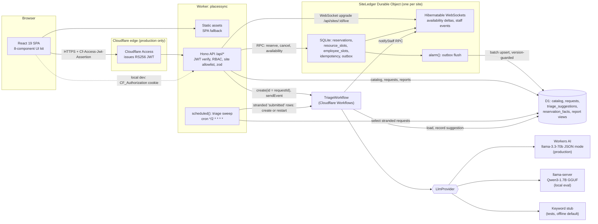
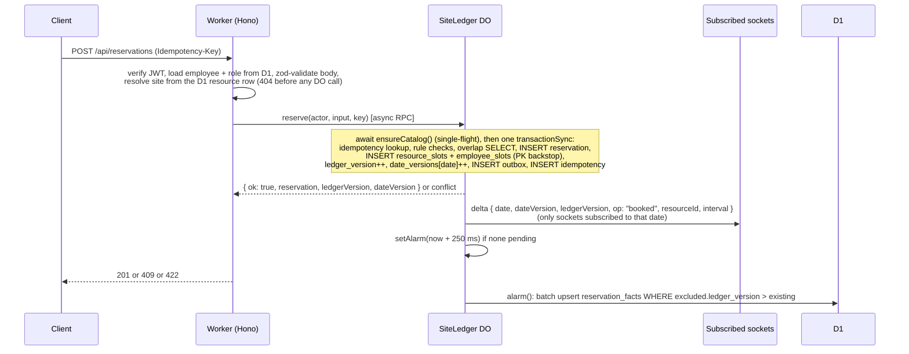

# PlacesSync v1: Build Specification

> **Build note (2026-10-08).** This is the pre-build design, kept as reviewed. The repository now implements it. Where the build differs (for example ports 8783 and 8130 instead of 8788 and 8080, and llama-server with one 8,192-token slot instead of four 4,096-token slots), `PROGRESS.md` lists each deviation and the reason under "Deviations from SPEC.md". The status line below describes the state before the build.

Status: design only (2026-10-08), revision 2 after an adversarial review (Section 22 lists every finding and its resolution). Nothing in this directory except this file exists yet.

Numbers policy: the only numbers that may appear in the README Results section, or on the resume, are ones written to `evals/results/*.json` by this repo's own scripts. The few observations from a throwaway pre-build prototype are quarantined in Appendix A, labeled as such, and are never cited.
Target repo: `github.com/nitishsjsucs/placessync` (not created yet; `gh` is logged in as `nitishsjsucs`).
Author of record: Nitish Chowdary. This is a clean-room v1: no code, data, or assumptions are carried over from any earlier PlacesSync implementation.

---

## 0. The resume text this repo must make true

> Built a workplace-management application for reserving desks and meeting rooms, reporting facilities issues, and monitoring request status. Combined an accessible booking interface with real-time availability, conflict-safe reservation handling, and AI-assisted classification of maintenance requests.
>
> 1. Built a responsive React/TypeScript application supporting approximately 100 synthetic employees and 20 workplace resources, with searchable availability, booking calendars, cancellation flows, and role-based facilities dashboards.
> 2. Built authoritative reservation handling using Cloudflare Durable Objects and SQLite transactions, with WebSocket availability updates and D1 reporting models; evaluated approximately 1,000 competing reservation attempts, targeting zero overlapping confirmed bookings.
> 3. Built eight reusable UI components from Figma designs with keyboard navigation, clear validation, and mobile layouts, alongside a Workers AI triage workflow assigning facilities requests to four service categories for staff review.

Every number and mechanism above is an acceptance criterion. Section 12 maps each one to the test or eval that proves it. "Targeting zero" is replaced by a measurement: the contention eval reports the real count of overlapping confirmed bookings, and the resume reports whatever was measured.

> **Build note (2026-10-08): do not use the text above as written.** It was the target. Section 15 lists the parts the build cannot support yet. Until those items are done, the supportable wording is:
>
> - Summary: "a booking interface with automated accessibility checks and full keyboard support" instead of "an accessible booking interface" (Section 15 item 8: no manual screen-reader pass yet).
> - Bullet 2: replace "targeting zero overlapping confirmed bookings" with the count `evals/results/contention.json` reports, for example "0 overlapping confirmed bookings across 5 local runs of 1,000 concurrent attempts", and only while that file says so (Section 15 item 4).
> - Bullet 3: "Built eight reusable UI components from a documented design-token and ARIA contract spec, with keyboard navigation, clear validation and mobile layouts, alongside a Cloudflare Workflows triage pipeline with a Workers AI provider, evaluated locally with Qwen3-1.7B, that assigns facilities requests to four service categories for staff review." No Figma file exists and the components were not built from one (Section 15 item 1), and Workers AI inference has never run (Section 15 item 2).

---

## 1. Goals and non-goals

### Goals (v1)

1. One site ("PlacesSync HQ", `America/Los_Angeles`) with exactly 20 bookable resources (14 desks, 6 meeting rooms) and exactly 100 synthetic employees in three roles.
2. Employees search availability by date, time window, kind, floor, amenities, capacity and free text; book desks and rooms; view a per-resource week calendar; view and cancel their bookings.
3. One Durable Object per site (`SiteLedger`, SQLite-backed) is the only writer of reservations. Every booking and cancellation commits in a single `transactionSync` that checks overlaps with SQL and claims 15-minute slots under a primary-key constraint, so a missed check cannot produce a double booking.
4. Live availability over hibernatable WebSockets served by the same Durable Object. Every mutation bumps a per-date version (`date_versions`) in the same transaction, and clients detect gaps per date, so a booking on a date a socket does not watch never forces it to resubscribe. A global `ledger_version` still orders the outbox.
5. D1 holds the catalog (sites, employees, resources, amenities), facilities requests, and reporting models. Reservation facts reach D1 through a transactional outbox in the Durable Object, flushed by its alarm with version-guarded upserts.
6. Employees report facilities issues. A Cloudflare Workflow classifies each request into exactly one of four service categories through a pluggable LLM provider (Workers AI in production, a local OpenAI-compatible llama.cpp server or a deterministic stub locally), records the suggestion, and leaves the request in `awaiting_review` for facilities staff. Staff accept or reassign. A 24-hour review timer flags overdue reviews. No request can be stranded: a cron sweep every 2 minutes re-creates or restarts the workflow for any request still `submitted` after 2 minutes, after 3 failed attempts it hands the request to staff for manual categorization, and staff can categorize a `submitted` request by hand at any time.
7. Role-based dashboards: facilities staff (triage queue, request board, today's bookings) and facilities admins (utilization and request reports from D1, resource activation).
8. A UI kit of exactly eight reusable components with documented keyboard contracts, validation states, and mobile layouts, each with its own keyboard and axe test.
9. Cloudflare Access JWT verification in production; the same verifier runs locally against a locally generated RS256 key.
10. Two evals that write JSON results: a 1,000-attempt contention eval and a triage classification eval. The README Results section is generated from those JSON files and a test fails if anyone edits it by hand.
11. Everything runs and passes offline on this Mac and in GitHub Actions. Nothing requires a Cloudflare login until deploy.
12. Scope is split into Tier 1 (required; on its own it makes every resume bullet true) and Tier 2 (deferred if time runs short). Section 19 holds the cut line.

### Non-goals (v1)

- Multiple sites, or cross-site per-employee constraints.
- Recurring bookings, waitlists, check-in or no-show release, booking on behalf of another employee, maintenance holds.
- Calendar sync (Google, Outlook), email or push notifications.
- Identity providers other than Cloudflare Access; any password storage.
- Rate limiting (documented as a production follow-up using the Workers rate limiting binding).
- Production load testing, production scale claims, or real employee data.
- Deploying from this machine (no `wrangler login` here).
- The Cloudflare Agents SDK (`agents@0.27.0`). It was inspected and deliberately not used: its `Agent` base class owns WebSocket handling and full-state broadcast, while this design needs direct control of `transactionSync`, slot tables, and per-socket attachments; it also brings required peers (`@modelcontextprotocol/sdk@1.30.0` exact, `@modelcontextprotocol/client@2.0.0`, `@modelcontextprotocol/server@2.0.0`) this app has no use for. The plain `DurableObject` class from `cloudflare:workers` covers everything.
- AI Search, R2, Queues: not needed. The outbox plus alarm replaces a queue because it commits atomically with the booking, which a post-commit `queue.send()` cannot.

---

## 2. Architecture



### Reservation write path



### Key design decisions (recorded as ADRs in `docs/adr/`)

| ADR | Decision | Why |
|---|---|---|
| 0001 | One `SiteLedger` DO per site, not per resource | Per-employee invariants ("one desk at a time") span resources; a per-site DO checks them in the same transaction. 100 employees are far below the documented soft limit of 1,000 requests per second per object. Multi-site sharding is by `siteId`. |
| 0002 | Slot claims under a PRIMARY KEY in addition to an overlap SELECT | The SELECT produces a useful 409 body; the PK makes double-claiming a slot impossible even if the SELECT were wrong. Both run inside one `transactionSync`, so a PK violation rolls back the reservation row too. |
| 0003 | Transactional outbox plus alarm for D1 projection | The fact row commits with the booking; the flush is retried by the alarm; upserts are guarded by `ledger_version` so replays and reordering are harmless. |
| 0004 | Explicit Access JWT verification with `jose`, not `ctx.access` | Works on any route type, is testable locally against a generated key, and verifies `iss`, `aud`, `exp`, and RS256 explicitly. `ctx.access` exists in the generated runtime types (`CloudflareAccessContext`) but cannot be exercised offline. |
| 0005 | `@cloudflare/vitest-plugin@1.4.0` instead of `@cloudflare/vitest-pool-workers` | See Section 3.2. Records the version choice (1.4.0 aligns with wrangler 4.149.0 and miniflare 5.20261006.1-alpha, so the tree holds one copy of each) and the fallback (1.3.7). |
| 0006 | Workflow for triage | Durable per-step retries with backoff, step-level caching (classification is not re-run if the D1 write fails), a catchable fallback path, and a 24-hour review timer via `waitForEvent`. |
| 0007 | Per-date live versions | Sockets subscribe to dates, so gap detection must use a counter that only moves when that date changes. A global version would make every booking on any other date look like a gap. |
| 0008 | Cron sweep as the triage safety net | `create()` can fail after the D1 insert and a workflow can end `errored`; a periodic sweep over `submitted` rows (create, restart, or hand to staff) is simpler and more testable than distributed retries in the request path. |

---

## 3. Toolchain and pinned versions

### 3.1 Versions (exact pins; verified installable and working together on 2026-10-08)

| Package | Version | Notes |
|---|---|---|
| node (local) | 25.9.0 | Runs `scripts/*.ts` directly via built-in type stripping (verified). |
| node (CI, `.nvmrc`) | 24 | `engines.node: ">=22.22"` because `react-router@8.4.0` requires it. |
| npm | 11.12.1 | Lockfile committed. Verified the macOS-generated lockfile lists `@rolldown/binding-linux-x64-gnu`, `@cloudflare/workerd-linux-64`, `@esbuild/linux-x64`, `lightningcss-linux-x64-gnu`. |
| wrangler | 4.149.0 | |
| @cloudflare/vite-plugin | 1.63.1 | Peer `wrangler ^4.149.0`, `vite ^6.1 \|\| ^7 \|\| ^8`. |
| @cloudflare/vitest-plugin | 1.4.0 | Replaces the deprecated pool-workers package (3.2). Depends on (does not bundle) `wrangler@4.149.0` and `miniflare@5.20261006.1-alpha`, the same versions `@cloudflare/vite-plugin@1.63.1` uses, so `npm ls miniflare wrangler` shows a single deduped copy (verified). 1.3.7 pulled a second wrangler 4.148.0 and miniflare 5.20261006.0-alpha. Fallback: 1.3.7. |
| vitest, @vitest/runner, @vitest/snapshot | 4.1.11 | Not vitest 5. |
| vite | 8.3.4 | |
| @vitejs/plugin-react | 6.1.2 | |
| typescript | 7.0.2 | Native compiler, typecheck only (`tsc -b`, `noEmit`). Verified identical diagnostics to 5.9.3 on the prototype project and that `tsc -b` with references works. Fallback: 6.0.3 if any tool needs the JS compiler API. |
| hono | 4.13.13 | Subpaths used: `hono/factory`, `hono/cookie`, `hono/http-exception`, `hono/secure-headers`, `hono/request-id`. |
| @hono/zod-validator | 0.9.1 | Peer `zod ^3.25 \|\| ^4`, `hono >=4.11.2`. |
| zod | 4.6.5 | Shared request/response schemas. |
| jose | 6.2.12 | RS256 verify; `createRemoteJWKSet`, `createLocalJWKSet`, `customFetch`. |
| react, react-dom, @types/react, @types/react-dom | 19.3.0 | |
| react-router | 8.4.0 | `createBrowserRouter`, `RouterProvider` (from `react-router/dom`), `NavLink`, `useSearchParams`. |
| jsdom | 30.1.2 | UI unit tests. |
| @testing-library/react / dom / user-event | 16.3.3 / 10.4.2 / 14.6.7 | |
| axe-core | 4.14.0 | Component-level a11y assertions. |
| @playwright/test | 1.63.0 | Pinned because it uses Chromium revision 1243, which is already cached at `~/Library/Caches/ms-playwright/chromium-1243`; 1.64.0 would need a new browser download (1248). |
| @axe-core/playwright | 4.13.0 | |
| @types/node | 24.19.1 | Scripts and configs only. |
| Workers runtime types | generated | `npm run types` = `wrangler types --env-file .dev.vars.example --strict-vars=false` writes `worker-configuration.d.ts` (committed). `npm run types:check` adds `--check`. `--env-file` replaces `.dev.vars` as the source of secret keys (verified: `--check` exits 0 both with no `.dev.vars` and with a `.dev.vars` holding extra keys), so local and CI agree. `--strict-vars=false` types every var as `string` (verified; with strict vars `TRIAGE_PROVIDER` became the literal union `"workers-ai" \| "stub"`), and `config.ts` narrows them with zod. `@cloudflare/workers-types` is not a dependency: `wrangler types` reports it is superseded by generated runtime types. |
| GitHub Actions | `actions/checkout@v7`, `actions/setup-node@v7`, `actions/upload-artifact@v7` | Latest majors per `gh api repos/<action>/releases/latest`. |

`compatibility_date`: `"2026-10-01"`. No compatibility flags are needed (no Node.js APIs in the Worker).

### 3.2 Deviation from the brief: vitest-pool-workers is deprecated

The brief names `@cloudflare/vitest-pool-workers`. On 2026-10-07 npm marked `@cloudflare/vitest-pool-workers@0.23.0` deprecated ("renamed to @cloudflare/vitest-plugin. This package will not receive future updates"). Cloudflare's migration guide states the API and Vitest configuration are unchanged; only the package name and the types path (`@cloudflare/vitest-plugin/types`) change.

Observed on this Mac:
- `@cloudflare/vitest-plugin@1.4.0` + `vitest@4.1.11` + `wrangler@4.149.0`: the prototype suite (1,000 concurrent reserves, outbox alarm drain, WebSocket hibernation, Workflow events, jose RS256, scheduled handler, `reset()`, a separate WebSocket project) passes. 1.4.0 was published 2026-10-08; its release notes list V8 coverage support, Vitest 5 support, and dependency alignment, with no breaking changes.
- `@cloudflare/vitest-plugin@1.3.7` also passes, but brings its own wrangler 4.148.0 and miniflare 5.20261006.0-alpha next to the 4.149.0 / 5.20261006.1-alpha used by `vite dev` and `vite preview`.
- `@cloudflare/vitest-pool-workers@0.23.0`: fails to start with `compatibility_date` 2026-10-01 ("newest date supported by this server binary is 2026-08-22") because it depends on miniflare 5.20260815.0-alpha. With the date lowered to 2026-08-22 it started but hung with no test output for several minutes in a project that also had the plugin installed (not root-caused).

Decision: use `@cloudflare/vitest-plugin@1.4.0`, the same Workers Vitest integration under its new name, recorded in ADR 0005. The README says "Workers Vitest integration (`@cloudflare/vitest-plugin`, formerly `@cloudflare/vitest-pool-workers`)". This deviates from the brief's named package, so it is listed for Nitish's confirmation in Section 15.

### 3.3 TypeScript configuration

All three leaf configs (`tsconfig.app.json`, `tsconfig.worker.json`, `tsconfig.node.json`) set:

```jsonc
{
  "strict": true,
  "noUncheckedIndexedAccess": true,
  "noEmit": true,
  "allowImportingTsExtensions": true,   // src/shared uses .ts-extension imports so Node can run it directly
  "erasableSyntaxOnly": true,           // no enums, namespaces or parameter properties: Node type stripping cannot run them
  "verbatimModuleSyntax": true,
  "isolatedModules": true,
  "module": "esnext",
  "moduleResolution": "bundler",
  "target": "es2024",
  "skipLibCheck": true
}
```

Verified with TypeScript 7.0.2 on a three-reference fixture that includes a shared folder: `tsc -b` passes; removing `allowImportingTsExtensions` from one config gives TS5097 on the shared file; adding an `enum` to the shared folder gives TS1294. `tsconfig.json` holds only `references`.

---

## 4. Exact file tree

```
placessync/
├── .github/workflows/ci.yml
├── .gitignore                    # node_modules, dist, .wrangler, .dev.vars, .seed/, playwright-report, test-results, evals/results/ci-*
├── .dev.vars.example             # committed: every secret key with a placeholder value; the source for `wrangler types`
├── .nvmrc                        # 24
├── CONTEXT.md                    # domain glossary (Site, Resource, Reservation, Slot claim, Ledger version, Date version, Outbox, Triage suggestion, Review, Sweep)
├── LICENSE                       # MIT
├── README.md
├── SPEC.md                       # this file
├── docs/adr/0001-one-ledger-per-site.md … 0008-triage-sweep.md
├── design/
│   └── FIGMA.md                  # placeholder: Nitish records the Figma file URL and frame-to-component map (Section 15)
├── index.html
├── package.json
├── package-lock.json
├── playwright.config.ts
├── tsconfig.json                 # references only
├── tsconfig.app.json             # src/client, src/shared, test/ui; lib DOM; types ["vite/client"]; shared options in 3.3
├── tsconfig.worker.json          # src/worker, src/shared, test/worker, test/ws; types ["./worker-configuration.d.ts", "@cloudflare/vitest-plugin/types"]
├── tsconfig.node.json            # scripts, e2e, test/node, *.config.ts, src/shared; types ["node"]
├── vite.config.ts                # plugins: [react(), cloudflare()]
├── vitest.config.ts              # projects: worker, worker-ws (shared storage, 1 worker), ui (jsdom), node
├── worker-configuration.d.ts     # generated by `wrangler types`, committed
├── wrangler.jsonc
├── migrations/
│   ├── 0001_catalog.sql
│   ├── 0002_reporting.sql
│   └── 0003_facilities.sql
├── public/
│   ├── _headers                  # CSP and security headers for static assets
│   └── favicon.svg
├── src/
│   ├── shared/                   # runtime-agnostic: workerd, browser, Node. No cloudflare:* imports. Relative imports use .ts extensions.
│   │   ├── api.ts                # zod schemas + inferred types for every request and response
│   │   ├── errors.ts             # ApiError codes
│   │   ├── intervals.ts          # overlaps(), mergeIntervals(), freeWindows(), countOverlappingPairs()
│   │   ├── live-protocol.ts      # WebSocket message schemas
│   │   ├── request-status.ts     # request status machine: nextStatus(current, action)
│   │   ├── rng.ts                # mulberry32 + helpers (pick, weighted, shuffle)
│   │   ├── roles.ts              # Role union, can(role, permission)
│   │   ├── rules.ts              # pure booking rules, used by the ledger and by the client for inline validation; takes a SiteRules value
│   │   ├── time.ts               # site-local date math via Intl, slot math, business days
│   │   ├── synthetic/
│   │   │   ├── index.ts          # SEED = 20261008, generateWorld(seed)
│   │   │   ├── names.ts          # fixed first/last name banks
│   │   │   ├── employees.ts      # exactly 100
│   │   │   ├── resources.ts      # exactly 20 (fixed table, Section 9.2)
│   │   │   ├── history.ts        # 20 past business days of bookings for reports
│   │   │   ├── contention.ts     # exactly 1,000 attempts over 2 dates (700 / 300) + contestedness stats
│   │   │   ├── request-templates.ts # two disjoint template pools: "eval" (generators) and "fewshot" (prompt examples only)
│   │   │   └── requests.ts       # 40 seed requests + 200 labeled eval requests, both from the "eval" pool
│   │   └── triage/
│   │       ├── categories.ts     # the four categories (as const tuple, length 4)
│   │       ├── prompt.ts         # system prompt + 8 few-shot examples rendered from the "fewshot" pool
│   │       ├── schema.ts         # JSON Schema for model output + zod parser
│   │       ├── classify.ts       # classifyRequest(provider, input)
│   │       ├── keyword-classifier.ts
│   │       ├── provider-labels.ts # provider id to human label; "AI" only for workers-ai
│   │       └── providers/
│   │           ├── types.ts      # LlmProvider interface
│   │           ├── openai-compatible.ts
│   │           ├── workers-ai.ts # takes an Ai-shaped object; no cloudflare imports
│   │           └── stub.ts
│   ├── worker/
│   │   ├── index.ts              # default { fetch, scheduled }, export { SiteLedger, TriageWorkflow }
│   │   ├── app.ts                # createApp(deps: AppDeps): Hono app (deps: verifierFactory, now, ids)
│   │   ├── config.ts             # parseConfig(env): zod-parsed, fail-closed config (Section 7.4)
│   │   ├── auth/
│   │   │   ├── access-verifier.ts
│   │   │   ├── dev-tokens.ts
│   │   │   ├── middleware.ts     # authenticate, requireRole, requireSameOrigin, requireKnownSite
│   │   │   └── principal.ts
│   │   ├── routes/
│   │   │   ├── health.ts  me.ts  resources.ts  availability.ts  calendar.ts
│   │   │   ├── reservations.ts  live.ts  requests.ts  staff.ts  admin.ts  dev.ts
│   │   ├── ledger/
│   │   │   ├── site-ledger.ts    # the Durable Object class
│   │   │   ├── ledger-for.ts     # ledgerFor(env, config, siteId): the ONLY call site of SITE_LEDGER.getByName
│   │   │   ├── schema.ts         # DO SQLite DDL + in-DO migrations
│   │   │   ├── outbox.ts         # flush logic
│   │   │   └── live.ts           # attachment type, broadcast helpers, expiry checks
│   │   ├── triage/
│   │   │   ├── triage-workflow.ts
│   │   │   ├── start-triage.ts   # startTriage(): create({ id: requestId }), "already exists" counts as success
│   │   │   ├── sweep.ts          # sweepStrandedRequests(env, now): the cron safety net (7.3)
│   │   │   └── provider-factory.ts
│   │   ├── repo/
│   │   │   ├── catalog.ts  employees.ts  requests.ts  reports.ts
│   │   └── seed.ts               # dev seed: generator output into D1 + ledger
│   └── client/
│       ├── main.tsx
│       ├── App.tsx               # router + role guards
│       ├── api/client.ts         # typed fetch using shared zod schemas
│       ├── live/socket.ts        # reconnecting WebSocket with backoff
│       ├── live/useLiveAvailability.ts  # per-date dateVersion tracking
│       ├── hooks/useMediaQuery.ts       # JS breakpoint switch (SlotGrid compact mode), testable with a matchMedia stub
│       ├── session/SessionProvider.tsx
│       ├── session/RequireRole.tsx
│       ├── shell/AppShell.tsx  shell/Nav.tsx  shell/Announcer.tsx
│       ├── ui/                   # THE UI KIT: exactly 8 components
│       │   ├── tokens.css
│       │   ├── Button.tsx      Button.module.css
│       │   ├── TextField.tsx   TextField.module.css
│       │   ├── Combobox.tsx    Combobox.module.css
│       │   ├── DateGrid.tsx    DateGrid.module.css
│       │   ├── SlotGrid.tsx    SlotGrid.module.css
│       │   ├── Dialog.tsx      Dialog.module.css
│       │   ├── Tabs.tsx        Tabs.module.css
│       │   ├── DataTable.tsx   DataTable.module.css
│       │   └── index.ts          # exports exactly these 8
│       └── pages/
│           ├── DevLoginPage.tsx  FindSpacePage.tsx  ResourcePage.tsx  MyBookingsPage.tsx
│           ├── ReportIssuePage.tsx  MyRequestsPage.tsx  RequestDetailPage.tsx
│           ├── StaffDashboardPage.tsx  AdminDashboardPage.tsx  UiGalleryPage.tsx  NotFoundPage.tsx
├── test/
│   ├── apply-migrations.ts       # setup file for the worker and worker-ws projects
│   ├── helpers/                  # tokens.ts (mint dev JWTs), world.ts (seed), ws.ts (event-driven waits, closeAll), fake-ai.ts, fake-fetch.ts, workflows.ts (introspectWorkflow wrapper)
│   ├── worker/                   # Section 12.1 (isolated storage per file)
│   ├── ws/                       # Section 12.1 (every test that opens a WebSocket; shared storage, 1 worker)
│   ├── ui/                       # Section 12.2; ui/setup.ts stubs window.matchMedia
│   └── node/                     # Section 12.3
├── e2e/
│   ├── global-setup.ts           # migrate local D1, seed via /api/dev/seed
│   ├── results-reporter.ts       # custom Playwright reporter that writes evals/results/e2e.json
│   ├── mobile-layout.spec.ts  keyboard-booking.spec.ts  a11y.spec.ts  realtime.spec.ts
├── scripts/
│   ├── dev-keys.ts               # writes .dev.vars with a fresh RS256 dev keypair
│   ├── seed-local.ts             # calls /api/dev/seed on a running local server
│   ├── export-catalog-sql.ts     # production catalog seed SQL; requires --admin-email (never hardcoded); writes to gitignored .seed/
│   ├── eval-contention.ts
│   ├── eval-triage.ts
│   └── render-results.ts         # README Results block from evals/results/*.json
└── evals/
    ├── README.md                 # how each eval runs, what each metric means
    ├── triage-labeling-guide.md
    ├── data/triage-hard.jsonl    # 40 ambiguous requests (10 per category), authored during the build (AI-assisted), labeled per the guide
    └── results/                  # committed JSON from local runs; the only source of README numbers
```

---

## 5. Configuration (`wrangler.jsonc`)

Verified finding: an `ai` binding in the active environment makes `wrangler dev` (also with `"remote": false` on the binding, and with `--local`) and `vite dev` try to open a remote proxy session and fail to start without a Cloudflare login. `vite preview` uses the same plugin path and is assumed to behave the same (not separately tested). Therefore the top-level (local) environment has no `ai` binding, and `env.production` redeclares every binding plus `ai`. `wrangler types` then generates `AI?: Ai` as optional on the merged `Env`, which the provider factory must handle.

```jsonc
{
  "$schema": "node_modules/wrangler/config-schema.json",
  "name": "placessync",
  "main": "src/worker/index.ts",
  "compatibility_date": "2026-10-01",
  "assets": {
    "binding": "ASSETS",
    "not_found_handling": "single-page-application",
    "run_worker_first": ["/api/*"]
  },
  "d1_databases": [
    { "binding": "DB", "database_name": "placessync-local", "database_id": "00000000-0000-0000-0000-000000000000", "migrations_dir": "migrations" }
  ],
  "durable_objects": { "bindings": [{ "name": "SITE_LEDGER", "class_name": "SiteLedger" }] },
  "migrations": [{ "tag": "v1", "new_sqlite_classes": ["SiteLedger"] }],
  "workflows": [{ "name": "placessync-triage", "binding": "TRIAGE_WORKFLOW", "class_name": "TriageWorkflow" }],
  "triggers": { "crons": ["*/2 * * * *"] },
  "vars": {
    "AUTH_MODE": "dev",
    "SITE_ID": "hq",
    "DEV_ACCESS_ISSUER": "https://placessync-dev.localhost",
    "DEV_ACCESS_AUD": "placessync-dev",
    "TRIAGE_PROVIDER": "stub",
    "LLM_BASE_URL": "http://127.0.0.1:8080/v1",
    "LLM_MODEL": "qwen3-1.7b"
  },
  "observability": { "enabled": true },
  "env": {
    "production": {
      "d1_databases": [
        { "binding": "DB", "database_name": "placessync", "database_id": "SET_AFTER_wrangler_d1_create", "migrations_dir": "migrations" }
      ],
      "durable_objects": { "bindings": [{ "name": "SITE_LEDGER", "class_name": "SiteLedger" }] },
      "workflows": [{ "name": "placessync-triage", "binding": "TRIAGE_WORKFLOW", "class_name": "TriageWorkflow" }],
      "ai": { "binding": "AI" },
      "vars": {
        "AUTH_MODE": "access",
        "SITE_ID": "hq",
        "ACCESS_TEAM_DOMAIN": "https://SET_ME.cloudflareaccess.com",
        "ACCESS_AUD": "SET_ME",
        "TRIAGE_PROVIDER": "workers-ai",
        "TRIAGE_MODEL": "@cf/meta/llama-3.3-70b-instruct-fp8-fast",
        "AI_GATEWAY_ID": ""
      }
    }
  }
}
```

Notes, all verified:
- No `assets.directory`: the Vite plugin supplies it. A plain `wrangler deploy --env production -c wrangler.jsonc` fails with "The `assets` property ... is missing the required `directory` property", so the only deploy path is `npm run deploy` (Vite build, then `wrangler deploy` using the redirected config at `.wrangler/deploy/config.json`).
- After any `vite build`, `wrangler dev` and `wrangler deploy` use the redirected build output (`dist/placessync/wrangler.json`). `npm run deploy` therefore always rebuilds with `CLOUDFLARE_ENV=production` first. `.env.production` must NOT set `CLOUDFLARE_ENV`, or local `npm run build` would select the production environment and preview would fail on the `ai` binding.
- `vite build` copies `.dev.vars` into `dist/placessync/.dev.vars`, and `vite preview` reads that copy. Changing `.dev.vars` (for example switching `TRIAGE_PROVIDER`) therefore needs `npm run build` again before `npm run preview` sees it; the README says so. `dist/` is gitignored; `wrangler deploy` does not upload `.dev.vars`; production uses `AUTH_MODE=access`, under which dev routes are not mounted and `DEV_*` values are ignored.
- `vite dev`, `vite preview`, `wrangler d1 migrations apply DB --local`, and Workflows all share `.wrangler/state/v3` (verified: a reservation made under `vite preview` conflicted under `vite dev`).
- `.dev.vars` (gitignored, written by `npm run setup:dev`): `DEV_ACCESS_PRIVATE_JWK`, `DEV_ACCESS_JWKS`, optional `TRIAGE_PROVIDER=openai-compat`.
- `.dev.vars.example` (committed) lists every secret key with a placeholder: `DEV_ACCESS_PRIVATE_JWK="REPLACE_WITH_npm_run_setup_dev"` and `DEV_ACCESS_JWKS="REPLACE_WITH_npm_run_setup_dev"`. It is the only input for `wrangler types` (`--env-file .dev.vars.example`), so generated types never depend on whether a developer has a `.dev.vars`. Optional overrides of plain vars (such as `TRIAGE_PROVIDER`) need no entry because they are already in `vars`.
- `.dev.vars` also leaks into the Vitest Workers runtime (verified: the plugin logs "Using secrets defined in .dev.vars" and an unpinned key showed up in `env`). Section 12 pins every var the tests depend on.
- `triggers.crons` is inherited by `env.production` (verified: the `CLOUDFLARE_ENV=production` build output carries `"crons": ["*/2 * * * *"]`).
- With `env.production`, the deployed Worker is named `placessync-production` (verified in the production build output: `name: placessync-production`, `topLevelName: placessync`). Its workers.dev hostname and the Access application must use that name.

### package.json scripts

| Script | Command |
|---|---|
| `setup:dev` | `node scripts/dev-keys.ts` |
| `db:migrate:local` | `wrangler d1 migrations apply DB --local` |
| `dev` | `vite` |
| `build` | `vite build` (local environment) |
| `build:production` | `CLOUDFLARE_ENV=production vite build` |
| `preview` | `vite preview --port 8788 --strictPort` |
| `seed:local` | `node scripts/seed-local.ts --base-url http://localhost:8788` |
| `deploy` | `npm run build:production && wrangler deploy` |
| `types` | `wrangler types --env-file .dev.vars.example --strict-vars=false` |
| `types:check` | `wrangler types --env-file .dev.vars.example --strict-vars=false --check` |
| `typecheck` | `tsc -b` |
| `test` | `vitest run` |
| `test:worker` / `test:ws` / `test:ui` / `test:node` | `vitest run --project <name>` |
| `test:e2e` | `playwright test` |
| `eval:contention` | `node scripts/eval-contention.ts` |
| `eval:triage` | `node scripts/eval-triage.ts` |
| `llm:serve` | `llama-server -m $HOME/Developer/projects/_models/Qwen3-1.7B-Q4_0-rtn.gguf --host 127.0.0.1 --port 8080 --reasoning off -c 16384 -np 4` |
| `results` | `node scripts/render-results.ts` |

`llm:serve` context: an explicit `-np` turns off the unified KV cache, so `-c` is split across slots. With `-c 4096 -np 4` each slot had 1,024 tokens and an 8-shot prompt with a 2,000-character description was rejected with HTTP 400 `exceed_context_size_error` (reviewer's reproduction). With `-c 16384 -np 4` the installed llama-server (0.5.0, build 11146) logs `n_slots = 4, n_ctx_slot = 4096, kv_unified = 'false'`, and `GET /props` returns `default_generation_settings.n_ctx = 4096` and `total_slots = 4` (verified). The triage eval reads those values and refuses to run a prompt that does not fit (13.2).

---

## 6. Data model

### 6.1 D1 migrations

`migrations/0001_catalog.sql`

```sql
CREATE TABLE sites (
  id          TEXT PRIMARY KEY,
  name        TEXT NOT NULL,
  timezone    TEXT NOT NULL,
  open_min    INTEGER NOT NULL CHECK (open_min BETWEEN 0 AND 1440),
  close_min   INTEGER NOT NULL CHECK (close_min > open_min AND close_min <= 1440),
  horizon_days INTEGER NOT NULL DEFAULT 14 CHECK (horizon_days BETWEEN 1 AND 60)
);

CREATE TABLE employees (
  id           TEXT PRIMARY KEY,                 -- emp_001 .. emp_100
  email        TEXT NOT NULL UNIQUE COLLATE NOCASE,
  display_name TEXT NOT NULL,
  department   TEXT NOT NULL,
  role         TEXT NOT NULL CHECK (role IN ('employee','facilities_staff','facilities_admin')),
  home_site_id TEXT NOT NULL REFERENCES sites(id),
  active       INTEGER NOT NULL DEFAULT 1 CHECK (active IN (0,1)),
  created_at   TEXT NOT NULL
);
CREATE INDEX idx_employees_role ON employees(role);

CREATE TABLE resources (
  id          TEXT PRIMARY KEY,                  -- res_2a01 .. ; rooms res_redwood ..
  site_id     TEXT NOT NULL REFERENCES sites(id),
  kind        TEXT NOT NULL CHECK (kind IN ('desk','room')),
  name        TEXT NOT NULL,
  floor       INTEGER NOT NULL,
  zone        TEXT NOT NULL,
  capacity    INTEGER NOT NULL CHECK (capacity >= 1),
  description TEXT NOT NULL DEFAULT '',
  active      INTEGER NOT NULL DEFAULT 1 CHECK (active IN (0,1)),
  UNIQUE (site_id, name)
);
CREATE INDEX idx_resources_site_kind ON resources(site_id, kind, active);

CREATE TABLE amenities (id TEXT PRIMARY KEY, label TEXT NOT NULL);
CREATE TABLE resource_amenities (
  resource_id TEXT NOT NULL REFERENCES resources(id) ON DELETE CASCADE,
  amenity_id  TEXT NOT NULL REFERENCES amenities(id),
  PRIMARY KEY (resource_id, amenity_id)
);
```

`migrations/0002_reporting.sql`

```sql
CREATE TABLE reservation_facts (
  reservation_id TEXT PRIMARY KEY,
  site_id        TEXT NOT NULL,
  resource_id    TEXT NOT NULL,
  resource_kind  TEXT NOT NULL CHECK (resource_kind IN ('desk','room')),
  employee_id    TEXT NOT NULL,
  date           TEXT NOT NULL,                  -- site-local YYYY-MM-DD
  start_min      INTEGER NOT NULL,
  end_min        INTEGER NOT NULL,
  attendees      INTEGER NOT NULL,
  status         TEXT NOT NULL CHECK (status IN ('confirmed','cancelled')),
  created_at     TEXT NOT NULL,
  cancelled_at   TEXT,
  ledger_version INTEGER NOT NULL,
  projected_at   TEXT NOT NULL
);
CREATE INDEX idx_facts_site_date ON reservation_facts(site_id, date, status);
CREATE INDEX idx_facts_resource_date ON reservation_facts(resource_id, date);
CREATE INDEX idx_facts_employee_date ON reservation_facts(employee_id, date);

CREATE TABLE projection_state (
  site_id            TEXT PRIMARY KEY,
  max_ledger_version INTEGER NOT NULL,
  updated_at         TEXT NOT NULL
);

CREATE TABLE report_hours (hour INTEGER PRIMARY KEY);
INSERT INTO report_hours (hour) VALUES (7),(8),(9),(10),(11),(12),(13),(14),(15),(16),(17),(18);

CREATE VIEW v_resource_daily_utilization AS
SELECT f.site_id, f.resource_id, r.kind, r.name, f.date,
       COUNT(*)                         AS bookings,
       SUM(f.end_min - f.start_min)     AS booked_min,
       ROUND(1.0 * SUM(f.end_min - f.start_min) / (s.close_min - s.open_min), 4) AS utilization
FROM reservation_facts f
JOIN resources r ON r.id = f.resource_id
JOIN sites s     ON s.id = f.site_id
WHERE f.status = 'confirmed'
GROUP BY f.site_id, f.resource_id, f.date;

CREATE VIEW v_hourly_occupancy AS
SELECT f.site_id, f.date, f.resource_kind, h.hour, COUNT(*) AS occupied
FROM reservation_facts f
JOIN report_hours h ON f.start_min < (h.hour + 1) * 60 AND f.end_min > h.hour * 60
WHERE f.status = 'confirmed'
GROUP BY f.site_id, f.date, f.resource_kind, h.hour;

CREATE VIEW v_daily_booking_summary AS
SELECT site_id, date, resource_kind,
       SUM(status = 'confirmed') AS confirmed,
       SUM(status = 'cancelled') AS cancelled
FROM reservation_facts
GROUP BY site_id, date, resource_kind;
```

Projection upsert (run by the ledger alarm in a `DB.batch`), version-guarded. Verified locally that a stale version does not overwrite a newer row:

```sql
INSERT INTO reservation_facts (...) VALUES (...)
ON CONFLICT(reservation_id) DO UPDATE SET
  status = excluded.status, cancelled_at = excluded.cancelled_at,
  ledger_version = excluded.ledger_version, projected_at = excluded.projected_at
WHERE excluded.ledger_version > reservation_facts.ledger_version;
```

`migrations/0003_facilities.sql`

```sql
CREATE TABLE facilities_requests (
  id                   TEXT PRIMARY KEY,         -- req_<ulid>
  site_id              TEXT NOT NULL REFERENCES sites(id),
  reporter_id          TEXT NOT NULL REFERENCES employees(id),
  resource_id          TEXT REFERENCES resources(id),
  location_note        TEXT NOT NULL DEFAULT '',
  title                TEXT NOT NULL CHECK (length(title) BETWEEN 5 AND 120),
  description          TEXT NOT NULL CHECK (length(description) BETWEEN 20 AND 2000),
  status               TEXT NOT NULL CHECK (status IN ('submitted','awaiting_review','assigned','in_progress','resolved','cancelled')),
  triage_state         TEXT NOT NULL DEFAULT 'pending' CHECK (triage_state IN ('pending','suggested','unavailable')),
  triage_attempts      INTEGER NOT NULL DEFAULT 0,   -- workflow create/restart attempts made by the API and the sweep
  final_category       TEXT CHECK (final_category IN ('building_systems','electrical_av','furniture_fixtures','cleaning_safety')),
  review_decision      TEXT CHECK (review_decision IN ('accepted','reassigned','manual')),  -- manual: categorized with no suggestion shown
  reviewed_by          TEXT REFERENCES employees(id),
  reviewed_at          TEXT,
  workflow_instance_id TEXT,
  created_at           TEXT NOT NULL,
  updated_at           TEXT NOT NULL
);
CREATE INDEX idx_requests_status ON facilities_requests(site_id, status, created_at);
CREATE INDEX idx_requests_reporter ON facilities_requests(reporter_id, created_at);

CREATE TABLE triage_suggestions (
  request_id TEXT PRIMARY KEY REFERENCES facilities_requests(id),
  category   TEXT NOT NULL CHECK (category IN ('building_systems','electrical_av','furniture_fixtures','cleaning_safety')),
  confidence REAL NOT NULL CHECK (confidence BETWEEN 0 AND 1),
  rationale  TEXT NOT NULL,
  provider   TEXT NOT NULL CHECK (provider IN ('workers-ai','openai-compat','stub','keyword-fallback')),
  model      TEXT NOT NULL,
  attempts   INTEGER NOT NULL,
  latency_ms INTEGER NOT NULL,
  created_at TEXT NOT NULL
);

CREATE TABLE request_events (
  id         INTEGER PRIMARY KEY AUTOINCREMENT,
  request_id TEXT NOT NULL REFERENCES facilities_requests(id),
  type       TEXT NOT NULL CHECK (type IN ('submitted','triage_started','triage_retry','triaged','triage_unavailable','reviewed','review_observed','review_overdue','status_changed','cancelled')),
  actor_id   TEXT,
  data       TEXT NOT NULL DEFAULT '{}',
  at         TEXT NOT NULL
);
CREATE INDEX idx_request_events_request ON request_events(request_id, id);
CREATE UNIQUE INDEX ux_one_review_event ON request_events(request_id) WHERE type = 'reviewed';

CREATE VIEW v_request_category_summary AS
SELECT site_id, COALESCE(final_category, '(unreviewed)') AS category, status, COUNT(*) AS n
FROM facilities_requests GROUP BY site_id, category, status;

CREATE VIEW v_triage_agreement AS
SELECT s.provider, COUNT(*) AS reviewed,
       SUM(r.final_category = s.category) AS agreed,
       ROUND(1.0 * SUM(r.final_category = s.category) / COUNT(*), 4) AS agreement_rate
FROM facilities_requests r JOIN triage_suggestions s ON s.request_id = r.id
WHERE r.review_decision IN ('accepted','reassigned')   -- 'manual' reviews never saw a suggestion
GROUP BY s.provider;
```

`v_triage_agreement` is always grouped by `provider`; nothing in the API or UI aggregates across providers (14.1 labels each row).

Timestamps are ISO-8601 strings supplied by the application (deterministic seeds; no reliance on SQL time functions). Note: D1 rejects some SQLite functions (verified: `sqlite_version()` returns "not authorized"); the schema uses only core SQL.

The negative-control table `naive_reservations` is deliberately absent from all migrations, so the production schema stays clean. The dev-only `POST /api/dev/naive/reset` runs `CREATE TABLE IF NOT EXISTS naive_reservations (...)` and then `DELETE FROM naive_reservations`; the route is never mounted in `access` mode (tested in `auth.test.ts`).

### 6.2 SiteLedger Durable Object SQLite schema (`src/worker/ledger/schema.ts`)

Applied in the constructor under `ctx.blockConcurrencyWhile`, guarded by `meta.schema_version`.

```sql
CREATE TABLE IF NOT EXISTS meta (key TEXT PRIMARY KEY, value TEXT NOT NULL);
-- keys: schema_version, ledger_version, catalog_synced_at, backstop_hits, last_flush_error, flush_failures

CREATE TABLE IF NOT EXISTS site (                 -- copy of the D1 sites row; rules read timezone, hours and horizon from here
  id TEXT PRIMARY KEY, timezone TEXT NOT NULL, open_min INTEGER NOT NULL, close_min INTEGER NOT NULL, horizon_days INTEGER NOT NULL
);

CREATE TABLE IF NOT EXISTS resources (            -- copy of the D1 catalog fields the rules need
  id TEXT PRIMARY KEY, kind TEXT NOT NULL, capacity INTEGER NOT NULL, active INTEGER NOT NULL
);

CREATE TABLE IF NOT EXISTS date_versions (        -- per-date live version (ADR 0007)
  date TEXT PRIMARY KEY, version INTEGER NOT NULL
) WITHOUT ROWID;

CREATE TABLE IF NOT EXISTS reservations (
  id TEXT PRIMARY KEY,                             -- rsv_<ulid>
  resource_id TEXT NOT NULL, employee_id TEXT NOT NULL, kind TEXT NOT NULL,
  date TEXT NOT NULL, start_min INTEGER NOT NULL, end_min INTEGER NOT NULL,
  attendees INTEGER NOT NULL DEFAULT 1, title TEXT,
  status TEXT NOT NULL CHECK (status IN ('confirmed','cancelled')),
  created_at INTEGER NOT NULL, cancelled_at INTEGER, cancelled_by TEXT, cancel_reason TEXT,
  version INTEGER NOT NULL,
  CHECK (start_min % 15 = 0 AND end_min % 15 = 0 AND end_min > start_min)
);
CREATE INDEX IF NOT EXISTS idx_rsv_resource_day ON reservations(resource_id, date, status);
CREATE INDEX IF NOT EXISTS idx_rsv_employee_day ON reservations(employee_id, date, status);

CREATE TABLE IF NOT EXISTS resource_slots (
  resource_id TEXT NOT NULL, date TEXT NOT NULL, slot INTEGER NOT NULL, reservation_id TEXT NOT NULL,
  PRIMARY KEY (resource_id, date, slot)
) WITHOUT ROWID;

CREATE TABLE IF NOT EXISTS employee_slots (
  employee_id TEXT NOT NULL, kind TEXT NOT NULL, date TEXT NOT NULL, slot INTEGER NOT NULL, reservation_id TEXT NOT NULL,
  PRIMARY KEY (employee_id, kind, date, slot)
) WITHOUT ROWID;

CREATE TABLE IF NOT EXISTS idempotency (
  employee_id TEXT NOT NULL, key TEXT NOT NULL, request_hash TEXT NOT NULL,
  response TEXT NOT NULL, created_at INTEGER NOT NULL,
  PRIMARY KEY (employee_id, key)
) WITHOUT ROWID;

CREATE TABLE IF NOT EXISTS outbox (
  seq INTEGER PRIMARY KEY AUTOINCREMENT, reservation_id TEXT NOT NULL,
  version INTEGER NOT NULL, payload TEXT NOT NULL, created_at INTEGER NOT NULL
);
```

Each mutation bumps its date with `INSERT INTO date_versions (date, version) VALUES (?, 1) ON CONFLICT(date) DO UPDATE SET version = version + 1 RETURNING version` inside the same `transactionSync` (verified in DO SQLite: returns 1, 2 for one date and 1 for another).

Slot = `start_min / 15`. A reservation covering 09:00 to 10:00 claims slots 36, 37, 38, 39. `employee_slots` enforces "an employee holds at most one desk at any time" (`kind = 'desk'`) and "an organizer holds at most one room at any time" (`kind = 'room'`); a desk and a room may overlap for the same employee.

---

## 7. Server components

### 7.1 `SiteLedger` (Durable Object, `extends DurableObject<Env>` from `cloudflare:workers`)

One instance per site, reached only through `ledgerFor(env, config, siteId)` (7.5), which calls `env.SITE_LEDGER.getByName(siteId)` after the allowlist check.

In-memory state (all re-derivable after eviction): `alarmPending: boolean`, `catalogLoad: Promise<void> | null` (single-flight catalog sync), `clockOverride?: () => number` (tests only, set via `runInDurableObject`).

| Method (RPC unless noted) | Signature | Behaviour |
|---|---|---|
| `constructor` | `(ctx, env)` | `blockConcurrencyWhile`: apply schema; if `outbox` is non-empty and `getAlarm()` is null, `setAlarm(now)`; `ctx.setWebSocketAutoResponse(new WebSocketRequestResponsePair('{"type":"ping"}','{"type":"pong"}'))` so keepalives never wake the object. |
| `reserve` | `async (actor: Actor, input: ReserveInput, idempotencyKey: string) => Promise<ReserveResult>` | First `await this.ensureCatalog()`: if the `site` or `resources` table is empty, it awaits the single shared `catalogLoad` promise (created once, cleared on failure), so N concurrent first requests after a reset trigger one `syncCatalog`. Then one synchronous `transactionSync` with no `await` inside: (1) idempotency lookup by `(employee_id, key)`: same `request_hash` returns the stored response, different hash returns `idempotency_key_reuse`; (2) the catalog must contain the resource with `active = 1`; (3) `rules.validate(input, resource, siteRules, now)` from `src/shared/rules.ts`, with `siteRules` read from the ledger `site` row; (4) overlap SELECT on `resource_id, date` returning conflicting intervals; (5) employee SELECT on `employee_id, kind, date`; (6) INSERT reservation; INSERT one `resource_slots` and one `employee_slots` row per slot; (7) `ledger_version += 1`; bump `date_versions[date]`; INSERT outbox; INSERT idempotency. Conflicts return a result (not throw) so the idempotency row commits. A UNIQUE violation from step 6 throws inside the transaction (rolling back everything), is caught outside, increments `meta.backstop_hits`, and returns `resource_conflict`. After commit: schedule flush, broadcast delta. |
| `cancel` | `async (actor, reservationId, reason?) => Promise<CancelResult>` | `ensureCatalog`, then `transactionSync`: must exist and be `confirmed`; owner or `facilities_admin` only; `start` must be in the future (site-local); DELETE slot claims; status `cancelled`; `ledger_version++`; bump `date_versions[date]`; outbox. Broadcast `released` delta. |
| `availability` | `(date, resourceIds?: string[]) => { date, dateVersion, ledgerVersion, busy: Record<resourceId, Interval[]> }` | Read-only. `dateVersion` is 0 for a date with no mutations. |
| `reservationsFor` | `(employeeId, fromDate, toDate, status?) => Reservation[]` | Own bookings list. |
| `calendar` | `(resourceId, weekStart, viewerId) => CalendarWeek` | 7 days of busy intervals; `mine` flag only, never other employees' ids. |
| `exportDay` | `(date) => Reservation[]` | Admin/eval: full confirmed list for invariant checks. |
| `projectionStatus` | `() => { ledgerVersion, outboxDepth, backstopHits, lastFlushError }` | |
| `syncCatalog` | `async () => { resources: number }` | The site id is `this.ctx.id.name` (set because every stub comes from `getByName`; verified locally that it is populated inside the object and survives eviction; if it is ever undefined the call throws `unknown_site`). Reloads the `site` row (`SELECT id, timezone, open_min, close_min, horizon_days FROM sites WHERE id = ?`) and `resources` (`SELECT id, kind, capacity, active FROM resources WHERE site_id = ?`) from D1, then replaces both tables in one `transactionSync`. If the D1 site row is missing it throws `unknown_site` and writes nothing. Called by seed and admin resource updates; `ensureCatalog` calls it lazily (single-flight) when either table is empty. |
| `notifyStaff` | `(event: StaffEvent) => { delivered: number }` | Sends to sockets whose attachment has `staff: true`. Called by the Workflow. |
| `importHistory` | `(rows: HistoryRow[]) => { imported, rejected }` | Dev seed only (route guarded). Same slot claims and transaction, but skips the "not in the past" rule. |
| `resetForDev` | `() => void` | Dev seed only: drops all ledger data, keeps schema. |
| `fetch` (handler) | `(request) => Response` | WebSocket upgrade only. Reads `X-PlacesSync-Actor` (set by the Worker after authentication; the Worker builds a fresh Request so client-sent copies never pass through). `ctx.acceptWebSocket(server)`; `server.serializeAttachment({ employeeId, role, staff, exp, dates: [] })`, where `exp` is the verified token's expiry (seconds) and `role` the D1 role at upgrade time. Returns 101. |
| `webSocketMessage` | `(ws, message)` | First checks `exp`: if `now >= exp`, sends `{ type: "error", code: "session_expired" }` and closes with 4001, so the client reconnects and re-authenticates (which also re-reads the role). Otherwise parses with `live-protocol.ts`. `subscribe {date}`: add date (max 14) to the attachment, re-serialize, send `snapshot`. `unsubscribe {date}`. `subscribe_staff` (attachment role staff/admin only). Invalid input: `error` message. |
| `webSocketClose` / `webSocketError` | | Close the socket; nothing else to clean up. |
| broadcast helpers (`live.ts`) | internal | Before sending any delta or `staff_event`, each socket's attachment `exp` is checked; an expired socket is closed with 4001 instead of receiving data. A demoted staff member therefore stops receiving `staff_event`s no later than token expiry (8 h for dev tokens; the Access session duration in production). v1 has no role-change API (roles come from seed or a manual D1 edit), so this bound is documented rather than enforced sooner. |
| `alarm` | `(info?: AlarmInvocationInfo)` | Reads up to 50 outbox rows in `seq` order, `env.DB.batch([...upserts, projection_state upsert])`, deletes flushed rows, resets `meta.flush_failures` to 0, re-arms if rows remain. On failure the error is caught (never rethrown, so the platform's own retry budget is not used): records `last_flush_error`, increments `meta.flush_failures`, and re-arms with backoff `min(2^flush_failures * 1 s, 60 s)`; never drops rows. `info.retryCount` is not used: it counts platform retries, and the alarms docs say those happen only when `alarm()` fails with an uncaught exception, so with errors caught it stays 0. Also purges idempotency rows older than 24 h. |

Invariant enforcement summary:
- I1 (resource): no two `confirmed` reservations on one resource overlap. Overlap SELECT plus `resource_slots` PK.
- I2 (employee desk) and I3 (organizer room): via `employee_slots` PK and SELECT.
- I4 (versions): `ledger_version` strictly increases by 1 per committed mutation; `date_versions[d]` strictly increases by 1 per committed mutation on date `d` and never moves for other dates. Every delta carries both.
- I5 (projection): every committed mutation has exactly one outbox row in the same transaction.

Rules (`src/shared/rules.ts`, pure, shared with the client for inline validation; the client gets `SiteRules` from `/api/health`). Hours and horizon come from the `SiteRules` value (`{ timezone, openMin, closeMin, horizonDays }`), never from constants:
- `date` is today..today+`horizonDays` (14 for `hq`) in site-local time; Monday to Friday only.
- `startMin`, `endMin` multiples of 15, inside `openMin` to `closeMin` (07:00 to 19:00 for `hq`); start strictly after "now" when the date is today.
- Desk duration 60 to 600 minutes; room duration 15 to 240 minutes.
- Desk `attendees = 1`; room `1 <= attendees <= capacity`.
- `title` optional, at most 80 chars, rooms only.

Concurrency notes: `sql.exec` is synchronous and the transaction body runs without an `await`, so no other event interleaves inside it; the only `await` in `reserve` is `ensureCatalog`, which happens before the transaction and only reads catalog data. The PK backstop is defence in depth. The prototype behaviour that motivated this design is in Appendix A and is not a result.

### 7.2 Live protocol (`src/shared/live-protocol.ts`)

Client to server:
- `{ "type": "subscribe", "date": "2026-10-13" }`
- `{ "type": "unsubscribe", "date": "2026-10-13" }`
- `{ "type": "subscribe_staff" }`
- `{ "type": "ping" }` (answered by the auto-response without waking the DO)

Server to client:
- `{ "type": "snapshot", "date", "dateVersion", "ledgerVersion", "busy": { [resourceId]: [{ "startMin", "endMin", "mine": boolean }] } }`
- `{ "type": "delta", "date", "dateVersion", "ledgerVersion", "op": "booked" | "released", "resourceId", "startMin", "endMin", "mine": boolean }`
- `{ "type": "staff_event", "event": "triage_ready" | "triage_overdue" | "triage_unavailable" | "request_updated", "requestId", "category"? }`
- `{ "type": "error", "code": "bad_message" | "forbidden" | "too_many_dates" | "session_expired" }`

Deltas go only to sockets whose attachment lists that date, and never contain another employee's id. The client (`useLiveAvailability`) keeps `lastDateVersion` per subscribed date, applies a delta for date `d` only when `dateVersion = lastDateVersion[d] + 1`, ignores a delta with `dateVersion <= lastDateVersion[d]` (duplicate), re-subscribes `d` for a fresh snapshot when `dateVersion > lastDateVersion[d] + 1` (gap), and reconnects with jittered exponential backoff (0.5 s to 15 s). `ledgerVersion` is informational on the client; gap detection never uses it, so bookings on other dates cannot cause resubscribes (ADR 0007).

### 7.3 `TriageWorkflow` (`extends WorkflowEntrypoint<Env, { requestId: string; siteId: string }>`)

Instance id = request id (`env.TRIAGE_WORKFLOW.create({ id: requestId, params })`).

| Step | Config | Does |
|---|---|---|
| `load-request` | retries `{ limit: 3, delay: "1 second", backoff: "exponential" }` | Reads title, description, resource name, location note from D1. Missing request: `NonRetryableError` (from `cloudflare:workflows`). |
| `classify` | retries `{ limit: 2, delay: "2 seconds", backoff: "exponential" }`, timeout `"60 seconds"` | `classifyRequest(provider, input)`; throws on transport error or schema-invalid output so Workflows retries. Returns `{ category, confidence, rationale, provider, model, latencyMs, attempts }`. |
| `classify-fallback` | only in the `catch` around `classify` | Keyword classifier; `provider = "keyword-fallback"`. The category is always one of the four. |
| `record-suggestion` | default retries | One `DB.batch`: `INSERT INTO triage_suggestions ... ON CONFLICT DO NOTHING`; `UPDATE facilities_requests SET status='awaiting_review', triage_state='suggested' WHERE id=? AND status='submitted'`; `INSERT request_events (type='triaged')`. Idempotent. Returns whether the UPDATE changed the row. If it did not (staff already categorized the request by hand, or the reporter cancelled it), the suggestion is stored but excluded from agreement (`review_decision = 'manual'`), and the workflow skips `notify-staff` and the review wait and completes, so staff get no stale `triage_ready`. |
| `notify-staff` | retries `{ limit: 2, delay: "1 second" }`, errors swallowed | `ledgerFor(env, config, siteId).notifyStaff({ event: "triage_ready", requestId, category })`. |
| `waitForEvent("review-outcome", { type: "review_outcome", timeout: "24 hours" })` | in try/catch | Event payload `{ outcome: "reviewed" \| "cancelled", at }`. On event: step `record-review-latency` writes `review_observed` with minutes since `triaged`. On timeout (throws, caught): step `flag-overdue` first re-reads the request from D1 and acts only if it is still `awaiting_review`: then it writes `review_overdue` and notifies staff with `triage_overdue`. If the request was reviewed or cancelled meanwhile (the `sendEvent` was lost), it writes `review_observed` with the latency computed from `reviewed_at` and sends nothing. The instance completes either way. |

The staff review itself is authoritative in D1 (API writes it); the API then calls `(await env.TRIAGE_WORKFLOW.get(id)).sendEvent({ type: "review_outcome", payload })` best-effort. Verified in docs: events sent before `waitForEvent` is reached are buffered; event types allow only `^[a-zA-Z0-9_][a-zA-Z0-9-_]*$` (hence `review_outcome`, no dots); `waitForEvent` timeouts throw and can be caught. Request ids (`req_<ulid>`) match the instance id pattern and are under the 100-character limit.

#### Starting triage (`start-triage.ts`)

`POST /api/requests` does, in order:
1. Insert the request (`status='submitted'`, `triage_state='pending'`) and a `submitted` event in one `DB.batch`. This is the commit point; the request exists even if everything after fails.
2. `startTriage(env, requestId, siteId)`: `env.TRIAGE_WORKFLOW.create({ id: requestId, params })`, then `UPDATE ... SET triage_attempts = triage_attempts + 1, workflow_instance_id = ?` and a `triage_started` event. If `create` throws an error whose message contains `already_exists` (local Miniflare text, verified: `(instance.already_exists) Workflow instance with id "..." already exists`), or a follow-up `get(requestId)` succeeds, the instance exists and this counts as success. Any other error is logged, not rethrown.
3. Respond 201 `{ request, triage: "started" }`, or 201 `{ request, triage: "pending" }` when step 2 failed. The client shows "Classification pending; staff can still review it".

#### Stranded-request sweep (`sweep.ts`, `scheduled()` every 2 minutes)

`sweepStrandedRequests(env, now)` selects up to 25 rows `WHERE status = 'submitted' AND created_at < now - 2 min ORDER BY created_at`. For each row:

| Instance state (`get(id)` then `status()`) | Action |
|---|---|
| `get` throws (`instance.not_found` locally, verified) | `startTriage` (create). |
| `errored` or `terminated` | `instance.restart()` (verified locally: restart re-runs an errored instance), `triage_attempts + 1`, `triage_retry` event. |
| `queued`, `running`, `waiting`, `paused`, `waitingForPause` | Leave alone; the workflow is in flight. |
| `complete` or `unknown` while D1 still says `submitted` | Treat as failed: go to the hand-off below. |
| `triage_attempts >= 3` (checked first) | Hand-off: `UPDATE ... SET status='awaiting_review', triage_state='unavailable' WHERE id=? AND status='submitted'`, `triage_unavailable` event, `notifyStaff({ event: "triage_unavailable" })`. Staff categorize it manually. |

This covers every way a request could otherwise sit in `submitted` forever: `create` failing after the insert, an instance that ends `errored` for any reason (for example `load-request` raising `NonRetryableError`, or `record-suggestion` running out of retries during a D1 outage), and an instance that completes without recording anything. Tested with `createScheduledController` and a direct call to the exported `scheduled` handler (verified pattern).

#### Staff review (conditional write)

`POST /api/staff/requests/:id/review` takes `{ decision: "accept" }`, `{ decision: "reassign", category }`, or `{ decision: "categorize", category }`:
- `accept`: `UPDATE facilities_requests SET status='assigned', final_category=(SELECT category FROM triage_suggestions WHERE request_id=?1), review_decision='accepted', reviewed_by=?2, reviewed_at=?3, updated_at=?3 WHERE id=?1 AND status='awaiting_review' AND EXISTS (SELECT 1 FROM triage_suggestions WHERE request_id=?1)`.
- `reassign`: same guard, `final_category=?4`, `review_decision='reassigned'`.
- `categorize`: allowed when `status IN ('submitted','awaiting_review')` and no suggestion exists (`triage_state IN ('pending','unavailable')`); `review_decision='manual'`.
- In every case `meta.changes = 0` on the UPDATE returns 409 `not_reviewable` (already reviewed, cancelled, or the wrong decision for the state), so two staff members reviewing at once produce exactly one review. The `reviewed` event is written in the same `DB.batch` with `INSERT OR IGNORE`, and the partial unique index `ux_one_review_event` (one `reviewed` event per request) makes a second event impossible even for a double-click by the same reviewer.

### 7.4 Worker config parsing (`config.ts`, fail closed)

`parseConfig(env)` runs a zod schema over the raw env, whose vars are all typed `string` (3.1), and returns a discriminated union `{ ok: true, config } | { ok: false, issues }`:
- `AUTH_MODE`: `z.enum(["access", "dev"])`; anything else: every `/api/*` route returns 500 `misconfigured`.
- `access`: requires `ACCESS_TEAM_DOMAIN` (https URL whose host ends in `.cloudflareaccess.com`) and `ACCESS_AUD` (non-empty). Both reject the deploy placeholders: any value containing `SET_ME`, and empty strings, fail, so an unconfigured deploy answers 500 `misconfigured` instead of trying to verify against `https://SET_ME.cloudflareaccess.com`. Dev routes are not mounted. Cookie auth is not read.
- `dev`: requires `DEV_ACCESS_JWKS` (parses as a JWKS with at least one RS256 key; the `.dev.vars.example` placeholder fails); dev routes mounted; requests whose URL hostname is not `localhost`, `127.0.0.1`, or `[::1]` get 403 `dev_mode_remote_request` (protects against an accidental dev-mode deploy).

  > **Build note (2026-10-09).** The hostname comes from the client's Host header (the Vite plugin builds the request URL from it), so the guard stops an accidental dev-mode deploy and DNS rebinding, but not a peer who can reach a non-loopback listener and send `Host: localhost`. The build therefore also refuses to start the dev server or `vite preview` on a non-loopback host (`scripts/lib/loopback-only.ts`); see PROGRESS.md.
- `TRIAGE_PROVIDER`: `z.enum(["workers-ai", "openai-compat", "stub"])`. `workers-ai` with `env.AI` undefined: `/api/health` reports `triage: "misconfigured"` and the workflow uses the fallback classifier, recording `provider = keyword-fallback`, so the gap is visible in data.
- `SITE_ID`: non-empty slug; the allowlist in 7.5.

### 7.5 Site allowlist (`requireKnownSite`, `ledgerFor`)

Durable Object names must never come straight from a request. Every path to the ledger goes through `ledgerFor(env, config, siteId)`, which throws `unknown_site` unless `siteId === config.SITE_ID` (v1 is single-site; multi-site would check the D1 `sites` table and cache the set per isolate). On top of that:
- `requireKnownSite` middleware runs on every route with a `:siteId` parameter (`/api/sites/:siteId/resources`, `/availability`, `/live`) before any handler and returns 404 `site_not_found` for any other value.
- `POST /api/requests` validates `body.siteId` the same way (422 `validation` with an issue on `siteId`).
- Routes that take a `resourceId` (`/api/reservations`, `/api/resources/:id/calendar`) load the resource from D1 first (404 `resource_not_found`) and use its `site_id`.
- A node test (`ledger-for-guard.test.ts`) scans `src/worker/**/*.ts` and fails if `getByName(` appears anywhere except `ledger/ledger-for.ts`.

---

## 8. HTTP API

All bodies are JSON validated by zod schemas in `src/shared/api.ts` (the client reuses them). Errors: `{ "error": ErrorCode, "message": string, "issues"?: ZodIssue[], ...details }`.

Middleware order: `requestId` then `secureHeaders` then `config` then `requireSameOrigin` (non-GET and WebSocket upgrades: if `Origin` is present it must equal the request origin, else 403; this blocks CSRF and cross-site WebSocket hijacking against cookie-carrying requests) then `authenticate` then `requireRole` then `requireKnownSite` (routes with `:siteId`).

Auth column: `none`, `any` (any active employee), `staff` (`facilities_staff` or `facilities_admin`), `admin` (`facilities_admin`), `dev` (dev mode only, localhost only).

| Method | Path | Auth | Request | Response |
|---|---|---|---|---|
| GET | `/api/health` | none | | `{ ok, authMode, triage: "ready" \| "misconfigured", siteId, siteToday, siteRules: { timezone, openMin, closeMin, horizonDays } }` |
| GET | `/api/dev/users` | dev | | `{ users: { id, displayName, role, department }[] }` (100 rows) |
| POST | `/api/dev/login` | dev | `{ employeeId }` | Sets `CF_Authorization` (HttpOnly, SameSite=Strict, Path=/, 8 h); `{ token, expiresAt }` |
| POST | `/api/dev/logout` | dev | | clears cookie |
| POST | `/api/dev/seed` | dev (no token: it must work on an empty database, before any user exists) | `{ reset: boolean, history: boolean }` | `{ employees: 100, resources: 20, historyReservations, requests }` |
| POST | `/api/dev/naive/reset`, `/api/dev/naive/reserve`, GET `/api/dev/naive/export` | dev | same body as reservations | Deliberately unsafe read-then-write D1 booker used only as the eval's negative control (Section 13.1). `reset` creates `naive_reservations` with `CREATE TABLE IF NOT EXISTS` (it is in no migration). Never mounted in `access` mode (tested). |
| GET | `/api/me` | any | | `{ employee: { id, email, displayName, department, role } }` |
| GET | `/api/sites/:siteId/resources` | any | query `kind?, floor?, amenity?` (comma list), `minCapacity?, q?` | `{ resources: Resource[] }` |
| GET | `/api/sites/:siteId/availability` | any | query `date` (required), `from?, to?` (minutes), plus resource filters | `{ date, version, resources: { resource: Resource, busy: Interval[], freeWindows: Interval[], fitsWindow: boolean }[] }` |
| GET | `/api/resources/:resourceId/calendar` | any | query `weekStart` (Monday) | `{ resource, days: { date, busy: { startMin, endMin, mine, reservationId? }[] }[] }` (`reservationId` only when `mine`) |
| POST | `/api/reservations` | any | header `Idempotency-Key` (required, 8 to 64 chars); body `{ resourceId, date, startMin, endMin, attendees?, title? }` | 201 `{ reservation, version }`; 409 `{ error: "resource_conflict", conflicts: Interval[] }`; 409 `{ error: "employee_conflict", conflicts }`; 422 `{ error: "validation", issues }`; 422 `idempotency_key_reuse`; 404 `resource_not_found` |
| GET | `/api/reservations` | any | query `from, to, status?`; `employeeId?` (admin only) | `{ reservations: Reservation[] }` |
| POST | `/api/reservations/:id/cancel` | any (owner) or admin | `{ reason? }` | 200 `{ reservation, version }`; 403 `not_owner`; 409 `already_started` or `not_confirmed` |
| GET (upgrade) | `/api/sites/:siteId/live` | any | `Upgrade: websocket` | 101; 426 without upgrade; 401 unauthenticated; 403 bad Origin; 404 unknown site |
| POST | `/api/requests` | any | `{ siteId, resourceId?, locationNote?, title, description }` | 201 `{ request, triage: "started" \| "pending" }` (7.3); 422 unknown `siteId` or a `resourceId` not at that site |
| GET | `/api/requests` | any | query `status?` | own requests with suggestion and final category |
| GET | `/api/requests/:id` | owner or staff | | `{ request, suggestion?, events }` |
| POST | `/api/requests/:id/cancel` | owner | | allowed only from `submitted` or `awaiting_review`; sends `review_outcome {outcome:"cancelled"}` |
| GET | `/api/staff/requests` | staff | query `status?, category?, q?` | queue with suggestion, confidence, provider, age, `triage_state` (includes `submitted` rows older than 2 minutes, shown as "classification pending") |
| POST | `/api/staff/requests/:id/review` | staff | `{ decision: "accept" }`, `{ decision: "reassign", category }`, or `{ decision: "categorize", category }` | 200; status `assigned`; `reviewed` event; then best-effort `sendEvent`. 409 `not_reviewable` when the conditional UPDATE changed no row (7.3) |
| POST | `/api/staff/requests/:id/status` | staff | `{ status: "in_progress" \| "resolved", note? }` | 200, transitions checked by `request-status.ts` |
| GET | `/api/staff/bookings` | staff | query `date` | that day's bookings with employee display names (operational view) |
| GET | `/api/admin/reports/utilization` | admin | query `from, to, kind?` | rows from `v_resource_daily_utilization` + hourly occupancy + totals |
| GET | `/api/admin/reports/requests` | admin | query `from, to` | category summary, `v_triage_agreement`, median time-to-review (computed in TS) |
| GET | `/api/admin/reports/reservations` | admin | query `date` | raw `reservation_facts` for a day (used by the eval's parity check) |
| PATCH | `/api/admin/resources/:id` | admin | `{ active?, capacity?, description? }` | updates D1 then `ledger.syncCatalog()` |
| GET | `/api/admin/ledger/export` | admin | query `date` | `ledger.exportDay(date)` |
| GET | `/api/admin/projection/status` | admin | | `ledger.projectionStatus()` + D1 `projection_state` |

Static assets get CSP and security headers from `public/_headers` (verified: `_headers` applies to assets only, not to Worker responses, so API responses use Hono `secureHeaders`). CSP: `default-src 'self'; connect-src 'self'; img-src 'self' data:; style-src 'self'; frame-ancestors 'none'`.

---

## 9. Auth model

### 9.1 Roles

| Role | Count (synthetic) | Can |
|---|---|---|
| `employee` | 92 | search, book, cancel own, report issues, view own requests |
| `facilities_staff` | 6 | everything above + triage queue, review, status changes, today's bookings |
| `facilities_admin` | 2 | everything above + reports, resource admin, cancel any booking, ledger export |

Roles come only from `employees.role` in D1, looked up by the verified token's `email`. A token claim named `role` is ignored (tested). Unknown or inactive email: 403 `unknown_user`.

### 9.2 Token verification (`access-verifier.ts`)

`createAccessVerifier({ mode, issuer, audience, jwks })` returns `verify(token) => { email, sub }`, using `jwtVerify(token, keySet, { issuer, audience, algorithms: ["RS256"], clockTolerance: 30 })`.

| | Production (`AUTH_MODE=access`) | Local dev and tests (`AUTH_MODE=dev`) |
|---|---|---|
| Token source | `Cf-Access-Jwt-Assertion` header only (Cloudflare's docs recommend the header; the cookie "is not guaranteed to be passed") | header, else `CF_Authorization` cookie set by `/api/dev/login` |
| Key set | `createRemoteJWKSet(new URL(ACCESS_TEAM_DOMAIN + "/cdn-cgi/access/certs"))`, built by the injected `verifierFactory` and memoized inside the app instance (so tests get their own key set); `kid` matching handles Access's 6-week rotation | `createLocalJWKSet(JSON.parse(DEV_ACCESS_JWKS))` |
| `iss` | `ACCESS_TEAM_DOMAIN` | `DEV_ACCESS_ISSUER` (`https://placessync-dev.localhost`) |
| `aud` | `ACCESS_AUD` (Application Audience tag) | `DEV_ACCESS_AUD` |
| Signing | Cloudflare Access (RS256) | `scripts/dev-keys.ts` generates an RS256 pair; private JWK in `.dev.vars`; `/api/dev/login` signs |

Tests generate a fresh RS256 pair at Vitest config load (Node `jose.generateKeyPair`) and inject `DEV_ACCESS_JWKS` and `DEV_ACCESS_PRIVATE_JWK` through `miniflare.bindings`; no key material is committed.

Injection seam. `createRemoteJWKSet` caches keys per key-set object, and a module-level key set would be shared by every test in the isolate. So the verifier is never a module singleton:

```ts
export interface AppDeps {
  verifierFactory: (cfg: AuthConfig) => AccessVerifier;   // default: memoized per (mode, issuer, audience, jwksUrl) inside the app instance
  now: () => number;
  newId: (prefix: string) => string;
}
export function createApp(deps: AppDeps): Hono<AppEnv>;
// src/worker/index.ts: export default { fetch: createApp(defaultDeps).fetch, scheduled }
```

`jose` exposes `customFetch` as a `unique symbol` (verified in `jose@6.2.12` `dist/types/jwks/remote.d.ts`), so the test factory passes it as a computed key: `createRemoteJWKSet(url, { [customFetch]: fakeFetch })`, where `fakeFetch` serves a separate "team" JWKS and records the requested URL. The access-mode test builds its own app with that factory and switches mode per request without touching the shared bindings:

```ts
const app = createApp({ ...testDeps, verifierFactory: remoteFactoryWith(fakeFetch) });
const res = await app.fetch(req, { ...env, AUTH_MODE: "access", ACCESS_TEAM_DOMAIN: "https://team.cloudflareaccess.com", ACCESS_AUD: "aud-test" }, createExecutionContext());
```

It asserts the certs URL `https://team.cloudflareaccess.com/cdn-cgi/access/certs` was requested. This exercises the production code path without network access.

This is a local stand-in for Access, not Access: it proves the verifier's checks, not Cloudflare's login flow. The README says so.

---

## 10. AI provider interfaces and local fallbacks

### 10.1 The four categories (`src/shared/triage/categories.ts`)

```ts
export const CATEGORIES = ["building_systems", "electrical_av", "furniture_fixtures", "cleaning_safety"] as const;
```

| Category | Covers |
|---|---|
| `building_systems` | heating, cooling, ventilation, air quality, plumbing, leaks, water |
| `electrical_av` | power, outlets, lighting, displays, projectors, conferencing and AV gear |
| `furniture_fixtures` | desks, chairs, doors, locks, whiteboards, blinds, shelving |
| `cleaning_safety` | spills, trash, restroom supplies, pests, odors, trip hazards |

`evals/triage-labeling-guide.md` resolves ambiguous cases (for example "water dripping from a light fixture" is `building_systems` because the source is a leak).

### 10.2 Interface (`providers/types.ts`)

```ts
export interface LlmProvider {
  readonly id: "workers-ai" | "openai-compat" | "stub";
  readonly model: string;
  completeJson(req: {
    system: string;
    user: string;
    schema: JsonSchema;        // category enum, confidence 0..1, rationale string
    maxTokens: number;         // 160
    temperature: number;       // 0
    signal?: AbortSignal;
  }): Promise<{ text: string }>;
}
```

`classifyRequest(provider, input)` builds the prompt (system prompt with category definitions and 8 few-shot examples, 2 per category, rendered from the `fewshot` template pool in `request-templates.ts`; the generators only ever draw from the `eval` pool, and a test asserts the two pools share no template, no subject phrase, and no symptom phrase, which an exact-text check alone could not catch), calls `completeJson`, parses with zod (category must be one of four; confidence clamped to 0..1; rationale truncated to 160 chars because llama.cpp did not enforce `maxLength` in a verified run), and throws on invalid output so the Workflow step retries.

### 10.3 Implementations

| Provider | Where it runs | Request shape (verified) |
|---|---|---|
| `WorkersAiProvider(ai: Ai, model, gatewayId?)` | production only | `ai.run(model, { messages, response_format: { type: "json_schema", json_schema: <schema> }, max_tokens, temperature }, gatewayId ? { gateway: { id: gatewayId } } : undefined)`. Cloudflare's JSON mode puts the schema directly under `json_schema`. Model `@cf/meta/llama-3.3-70b-instruct-fp8-fast` is listed in both the JSON-mode docs and the generated `AiModels` types. `response` may arrive as a string or an already-parsed object; both are handled. "JSON Mode couldn't be met" errors are retried, then fall back. |
| `OpenAiCompatProvider(baseUrl, model, fetch)` | local evals, optional local dev | `POST {baseUrl}/chat/completions` with `{ model, messages, temperature: 0, seed: 7, max_tokens, response_format: { type: "json_schema", json_schema: { name: "triage", strict: true, schema } }, chat_template_kwargs: { enable_thinking: false } }`; reads `choices[0].message.content`. Verified against `llama-server` 0.5.0 (build 11146) serving `Qwen3-1.7B-Q4_0-rtn.gguf` with `--reasoning off`: returns schema-conforming JSON with the category inside the enum (a short no-few-shot probe; full-prompt behaviour is what the eval measures). An HTTP 400 `exceed_context_size_error` is surfaced as a distinct `context_overflow` error, not a generic retry. |
| `StubProvider` | unit tests, offline default | Wraps `keyword-classifier.ts`; deterministic. `id = "stub"`, `model = "keyword-v1"`. |
| keyword fallback | everywhere | Same classifier, used when a real provider fails after retries; recorded as `keyword-fallback`. |

`provider-factory.ts` selects by `TRIAGE_PROVIDER`. A Worker in local dev can call `http://127.0.0.1:8080` (verified: a Worker under `vite preview` fetched a local HTTP server), so `TRIAGE_PROVIDER=openai-compat` in `.dev.vars` runs the full Workflow against llama-server under `vite dev`, and under `vite preview` after `npm run build` (the build copies `.dev.vars`). It never affects `npm test`, which pins `TRIAGE_PROVIDER=stub` (12).

Prompt-injection note: request text is untrusted; the output is constrained to four categories and every suggestion is reviewed by staff, so the worst case is a wrong suggestion.

---

## 11. Synthetic data generators (`src/shared/synthetic/`)

All generators are pure functions of `seed` (default `SEED = 20261008`) using `mulberry32` (verified deterministic under Node 25 type stripping). They run unchanged in workerd (dev seed route, tests) and Node (evals). Each test pins a SHA-256 of the canonical JSON output, so any change is visible in review. `generateHistory` is the only date-dependent generator; its pinned hash uses the fixed `siteToday = "2026-10-08"` (`HISTORY_PIN_DATE`), and the dev seed passes the real `siteToday`.

### 11.1 Exact counts (acceptance criteria)

| Generator | Output | Exact count |
|---|---|---|
| `generateEmployees(seed)` | `emp_001`..`emp_100` (`emp_001`..`emp_092` employees, `emp_093`..`emp_098` staff, `emp_099`..`emp_100` admins); names from fixed banks; emails `first.last@placessync.test` (reserved TLD, de-duplicated with a numeric suffix) | **100**: 92 `employee` (Engineering 30, Product 10, Design 8, Sales 16, Operations 12, People 6, Finance 10), 6 `facilities_staff`, 2 `facilities_admin` (department Facilities) |
| `generateResources()` | fixed table below | **20**: 14 desks, 6 rooms |
| `generateContentionAttempts(seed)` | `att_0001`..`att_1000` | **1,000** (exactly 700 on date A, 300 on date B) |
| categories | constant | **4** |
| UI kit | `src/client/ui/index.ts` | **8** components |
| `generateSeedRequests(seed)` | dashboard demo data | 40 (10 per category by template, mixed statuses). Their suggestions are produced at seed time by running the stub classifier and stored with `provider = 'stub'`, `model = 'keyword-v1'`; no seeded row ever claims `workers-ai` or `openai-compat`. |
| `generateLabeledRequests(seed)` | triage eval, templated | 200 (50 per category), `eval` pool only |
| `evals/data/triage-hard.jsonl` | authored during the build (AI-assisted), labeled per `triage-labeling-guide.md`; not written by facilities staff | 40 (10 per category) |
| `generateHistory(seed, siteToday)` | past bookings for reports | the 20 business days before `siteToday`; booking count reported, not claimed |

### 11.2 Resource table (fixed)

| Id | Name | Kind | Floor/Zone | Capacity | Amenities |
|---|---|---|---|---|---|
| res_2a01..res_2a04 | Desk 2A-01..04 | desk | 2 / North | 1 | monitor; standing_desk (01, 02); window (01, 03) |
| res_2b01..res_2b04 | Desk 2B-01..04 | desk | 2 / South | 1 | docking_station; dual_monitor (01, 02) |
| res_3a01..res_3a03 | Desk 3A-01..03 | desk | 3 / North | 1 | monitor; window (01) |
| res_3b01..res_3b03 | Desk 3B-01..03 | desk | 3 / South | 1 | monitor; standing_desk (02) |
| res_redwood | Redwood | room | 2 / North | 4 | display, video_conf |
| res_sequoia | Sequoia | room | 2 / South | 8 | display, video_conf, whiteboard |
| res_cypress | Cypress | room | 2 / South | 2 | phone_booth |
| res_juniper | Juniper | room | 3 / North | 6 | display, whiteboard |
| res_alder | Alder | room | 3 / South | 10 | display, video_conf, whiteboard |
| res_madrone | Madrone | room | 3 / South | 12 | display, video_conf |

Site `hq`: "PlacesSync HQ", `America/Los_Angeles`, open 07:00 (420), close 19:00 (1140), horizon 14 days.

### 11.3 Contention attempts

Each attempt: `{ attemptId, employeeId, resourceId, dayOffset: 2 | 3, startMin, endMin, attendees, idempotencyKey: attemptId }`. The runner resolves `dayOffset` to the second (date A) or third (date B) business day after `siteToday` (from `/api/health`), so the generator output is date-independent and byte-stable.

- Date: a seeded shuffle of exactly 700 `dayOffset: 2` and 300 `dayOffset: 3` labels, so the counts are exact. Two dates make the per-date live protocol testable: an observer of date A must see none of date B's 300 attempts.
- Employee: uniform over all 100.
- Kind: 60% desk, 40% room. Resource within kind: Zipf weights (s = 1.1) over a fixed order, so a few resources are hot.
- Start: 70% peak windows (09:00 to 11:00 or 13:00 to 15:00), 30% uniform 07:00 to 17:00, on 15-minute boundaries.
- Duration: desks 120/240/480 min (weights 0.3/0.4/0.3); rooms 30/60/90/120 (0.35/0.35/0.15/0.15); clipped to close.
- Attendees: desks 1; rooms uniform 1..capacity.
- All attempts pass `rules.validate`, so every rejection must be a conflict.
- `contentionStats(attempts)` reports `contestedAttempts` (attempts overlapping at least one other attempt on the same resource and date), `peakSlotDemand`, `employeeCollisions`, and `attemptsPerDate`. Acceptance: `contestedAttempts >= 900`, so "competing" is demonstrable from the data itself. A throwaway prototype of this distribution (Appendix A) suggests the 700/300 split keeps the value well above 900; the real generator's test is the authority.

---

## 12. Test plan

Vitest projects in one `vitest.config.ts` (the worker, worker-ws and ui shapes were verified together on this Mac with plugin 1.4.0):

```ts
const pinned = {                       // every var the tests depend on; beats .dev.vars (verified)
  TEST_MIGRATIONS: migrations,
  AUTH_MODE: "dev", TRIAGE_PROVIDER: "stub", SITE_ID: "hq",
  DEV_ACCESS_ISSUER: "https://placessync-dev.localhost", DEV_ACCESS_AUD: "placessync-dev",
  DEV_ACCESS_JWKS: testJwks, DEV_ACCESS_PRIVATE_JWK: testPrivateJwk,
  LLM_BASE_URL: "http://127.0.0.1:9/v1", LLM_MODEL: "unused-in-tests",
};
const cf = () => cloudflareTest({ wrangler: { configPath: "./wrangler.jsonc" }, remoteBindings: false, miniflare: { bindings: pinned } });
projects: [
  { plugins: [cf()], test: { name: "worker", include: ["test/worker/**/*.test.ts"], setupFiles: ["./test/apply-migrations.ts"] } },
  { plugins: [cf()], test: { name: "worker-ws", include: ["test/ws/**/*.test.ts"], setupFiles: ["./test/apply-migrations.ts"],
      maxWorkers: 1, isolate: false, sequence: { groupOrder: 1 } } },
  { plugins: [react()], test: { name: "ui", environment: "jsdom", include: ["test/ui/**/*.test.tsx"], setupFiles: ["./test/ui/setup.ts"] } },
  { test: { name: "node", environment: "node", include: ["test/node/**/*.test.ts"] } },
]
```

- **`.dev.vars` leakage.** The plugin loads `.dev.vars` into the test runtime (verified: it logs "Using secrets defined in .dev.vars", and an unpinned key appeared in `env`). `miniflare.bindings` overrides only the keys it sets (verified: with `.dev.vars` setting `TRIAGE_PROVIDER=openai-compat` and `AUTH_MODE=access`, tests saw the pinned `stub` and `dev`). Hence the full `pinned` list, and `env-pins.test.ts` asserts each pinned value, so a developer's `.dev.vars` can never make local `npm test` call llama-server or differ from CI.
- **WebSockets and storage isolation.** Cloudflare's known-issues page says WebSockets with Durable Objects are not supported with per-file storage isolation and recommends `--max-workers=1 --no-isolate`. So every file that opens a WebSocket lives in `test/ws/` and runs in the `worker-ws` project with `maxWorkers: 1, isolate: false`. Vitest 4 refuses two projects with different `maxWorkers` and the same `sequence.groupOrder` (verified error: "Provide unique 'sequence.groupOrder' for them"), hence `groupOrder: 1`. Because storage is shared across those files, each `test/ws` file uses `beforeEach(applyD1Migrations)` and `afterEach(reset)` from `cloudflare:test` (verified: after `reset()` the DO and D1 data were empty and re-applied migrations worked), and every test closes all sockets (`helpers/ws.ts closeAll`) and reads or cancels every response body. Tests that call ledger RPC directly (not through the HTTP allowlist) may use a unique DO name per test; `helpers/world.ts` first inserts a D1 `sites` row with that id and copies of the 20 resources, because `syncCatalog` loads the catalog by the object's name.
- **Workflows in tests.** Any test that causes `TRIAGE_WORKFLOW.create` with a server-generated id wraps it in `await using intro = await introspectWorkflow(env.TRIAGE_WORKFLOW)` with `modifyAll(m => m.disableSleeps())`, and ends each instance through `mockEvent` or `forceEventTimeout`, so no instance sits in a 24-hour `waitForEvent` inside the test runtime.
- Tests wait on events with timeouts, never fixed sleeps. Worker tests send requests to `http://localhost/...` so the dev-mode host guard (7.4) applies to them exactly as in local dev.

### 12.1 Worker project (`test/worker/`)

| File | Proves |
|---|---|
| `env-pins.test.ts` | Every key in `pinned` has the pinned value in `env` (guards against `.dev.vars` leakage). |
| `config.test.ts` | `parseConfig`: `SET_ME` team domain, `SET_ME` AUD, empty values, a non-`cloudflareaccess.com` host, an unknown `AUTH_MODE`, an unknown `TRIAGE_PROVIDER`, and the `.dev.vars.example` placeholder JWKS each give `misconfigured`. |
| `synthetic.test.ts` | Exactly 100 employees with the 92/6/2 role split and unique `.test` emails; exactly 20 resources (14 desks, 6 rooms) matching 11.2; exactly 1,000 attempts (700 on date A, 300 on date B), all rule-valid, `contestedAttempts >= 900`; few-shot and eval template pools are disjoint; same seed gives identical SHA-256 (history pinned at `HISTORY_PIN_DATE`), different seed differs. |
| `seed.test.ts` | After `/api/dev/seed`: D1 has 100 employees and 20 resources; ledger catalog has 20 and the `site` row matches D1; all 100 employees can call `/api/me` with minted tokens (100 x 200); every seeded `triage_suggestions` row has `provider = 'stub'` and `model = 'keyword-v1'`, and no row has `provider = 'workers-ai'`. |
| `auth.test.ts` | Dev token accepted; rejects expired, wrong `aud`, wrong `iss`, wrong key, `alg: none`, HS256-signed; unknown email 403; `role` claim ignored. Access mode (own app via `createApp`, env overridden per request, 9.2): remote JWKS fetched from `${TEAM}/cdn-cgi/access/certs` via `[customFetch]`; dev token rejected; cookie ignored; `/api/dev/*` (including naive control) 404; missing or `SET_ME` `ACCESS_AUD` gives 500 `misconfigured`. Dev mode with non-localhost Host gives 403. Cross-origin POST and WebSocket upgrade give 403. Unknown `:siteId` on resources, availability and live gives 404 `site_not_found` and creates no Durable Object (`listDurableObjectIds(env.SITE_LEDGER)` unchanged). |
| `rbac.test.ts` | Full route x role matrix from Section 8 (employee cannot reach `/api/staff/*` or `/api/admin/*`; staff cannot reach `/api/admin/*`; non-owner cancel 403; admin cancel 200). For each role, `POST /api/requests` with an unknown `siteId` gives 422 and `GET /api/sites/evil/availability` gives 404. |
| `rules.test.ts` | Every rule in 7.1, driven by a `SiteRules` value, including boundaries (07:00 start ok, 19:00 end ok, 18:45 to 19:15 rejected, weekend rejected, horizon day 14 ok, 15 rejected, adjacency `end == start` ok), plus one case with a different `SiteRules` (08:00 to 17:00, horizon 7) to prove nothing is hardcoded. |
| `ledger.reserve.test.ts` | 201 shape; overlap 409 lists the conflicting interval; employee second-desk 409; desk plus room overlap allowed; capacity; inactive resource; idempotent replay returns the identical body and creates no row; same key with a different body gives `idempotency_key_reuse`. |
| `ledger.transaction.test.ts` | Rollback is real: via `runInDurableObject`, insert a stray `resource_slots` row without a reservation, then reserve over it: result `resource_conflict`, no reservation row, `ledger_version` and `date_versions` unchanged, outbox unchanged, `backstop_hits = 1`. Single-flight catalog: after `resetForDev`, 50 concurrent `reserve` calls trigger exactly one `syncCatalog` (counted through a test hook). |
| `ledger.cancel.test.ts` | Owner cancel frees slots (rebook succeeds); admin cancel; non-owner 403; already started 409 (clock override); double cancel 409; `date_versions` bumped for that date only. (The `released` delta is asserted in `test/ws/live.test.ts`.) |
| `availability.test.ts` | Filters (`kind`, `floor`, `amenity`, `minCapacity`, `q`) against a brute-force oracle over the fixed table; `freeWindows` equals a brute-force slot scan for 200 random seeded ledgers. |
| `calendar.test.ts` | Week view has 7 days, `mine` flags correct, never exposes other employees' ids. |
| `projection.test.ts` | Outbox rows equal mutations; `runDurableObjectAlarm` drains to D1; D1 rows equal ledger rows field by field; replaying a flush changes nothing; an older version never overwrites a newer one. Forced failure without a test seam: `ALTER TABLE reservation_facts RENAME TO rf_off`, run the alarm, assert `last_flush_error` contains "no such table", `flush_failures = 1`, the outbox rows remain and the next alarm is about 2 s out; a second failure gives `flush_failures = 2` and about 4 s; rename back, run the alarm, assert the drain and `flush_failures = 0` (verified: the rename makes local D1 `batch` fail with `no such table: reservation_facts`). After `evictDurableObject` the constructor re-arms the alarm when the outbox is non-empty. |
| `reports.test.ts` | Each view returns hand-computed values on a small fixture (utilization, hourly occupancy, summaries, agreement rate). |
| `contention.test.ts` | The 1,000 generated attempts (both dates) fired concurrently with `Promise.all` through `exports.default.fetch` with real tokens for the 100 employees; every response body is read. Asserts: 0 overlapping confirmed pairs per resource and date; 0 employee double-desk or double-room pairs; every 201 is in the ledger and every ledger row got a 201; every 409 conflicts with at least one confirmed booking (no unjustified rejections); 0 validation errors and 0 5xx; `date_versions[A]` equals the 201 count on A and likewise for B; D1 projection equals the ledger after draining the alarm; `backstop_hits = 0`. |
| `overlap-detector.test.ts` | `countOverlappingPairs` finds planted overlaps exactly (sensitivity) and reports 0 on adjacent intervals; the naive control route, fed the same 1,000 attempts, produces overlaps greater than 0. |
| `triage.categories.test.ts` | `CATEGORIES.length === 4`; the JSON Schema enum, zod enum, and D1 `CHECK` (insert of a fifth value fails) all match. |
| `triage.classify.test.ts` | Valid JSON parsed; out-of-enum category throws; confidence clamped; rationale truncated; few-shot examples never appear in the eval sets (exact-text check). |
| `triage.providers.test.ts` | Workers AI provider with a fake `Ai` object: model id, `response_format` shape, `gateway` option only when `AI_GATEWAY_ID` set, both `response` shapes. OpenAI-compatible provider with a fake fetch: URL, body (including `chat_template_kwargs`), error handling. Factory: missing `env.AI` reports misconfigured. |
| `triage.workflow.test.ts` | With `introspectWorkflowInstance`: stub provider path ends in `awaiting_review`, `triage_state = 'suggested'`, with a suggestion in one of the four categories; `mockStepError` on `classify` exhausts retries and the `classify-fallback` path records `keyword-fallback`; `disableRetryDelays` keeps it fast; `mockEvent({ type: "review_outcome" })` completes with `review_observed`; `forceEventTimeout` on a still-`awaiting_review` request records `review_overdue` and the instance status is `complete`, not `errored`; `forceEventTimeout` on a request already reviewed in D1 (no event sent) records `review_observed`, not `review_overdue`, and sends no `triage_overdue`; `mockStepError` on `record-suggestion` past its retries ends the instance `errored` with the request still `submitted` (the case the sweep fixes). |
| `sweep.test.ts` | Calls the exported `scheduled` handler with `createScheduledController({ cron: "*/2 * * * *" })` and `waitOnExecutionContext` (verified pattern), with the clock injected. Cases: (a) a `submitted` row older than 2 minutes with no instance (simulates `create` failing after the insert) gets an instance and `triage_attempts = 1`; (b) a row whose instance `errored` is restarted and then reaches `awaiting_review`; (c) a row younger than 2 minutes is untouched; (d) a running instance is untouched; (e) a row at `triage_attempts = 3` is handed to staff: `awaiting_review`, `triage_state = 'unavailable'`, `triage_unavailable` event; (f) at most 25 rows per run. |
| `requests.api.test.ts` | Wrapped in `introspectWorkflow(env.TRIAGE_WORKFLOW)` with `disableSleeps` and dispose (12, Workflows). Create starts the workflow with `id = requestId`; when `create` is forced to throw (deps seam) the response is still 201 with `triage: "pending"` and the row is `submitted`; a duplicate `create` (`already_exists`) counts as started; validation errors map to fields; unknown `siteId` 422; own list; staff queue includes pending rows; review accept, reassign, and categorize (on a `submitted` row with no suggestion, `review_decision = 'manual'`); accept on a row with no suggestion 409; two concurrent reviews of one request give exactly one 200 and one 409 `not_reviewable`, and exactly one `reviewed` event; illegal status transitions 409; reporter cancel sends `review_outcome`. |
| `request-status.test.ts` | Exhaustive transition table for `nextStatus`. |

`worker-ws` project (`test/ws/`, shared storage, one worker, `reset()` after each test):

| File | Proves |
|---|---|
| `live.test.ts` | Subscribe gets a snapshot with `dateVersion` and `ledgerVersion`; a booking produces one `booked` delta to subscribers of that date only, with `dateVersion = previous + 1`; cancel gives `released`; `mine` is per socket. **Cross-date case:** a socket subscribed only to date A sees no message at all (no delta, no snapshot, no error) while 10 bookings land on date B, and its next delta on A has `dateVersion = last + 1`. After `evictDurableObject(stub)` (hibernate) the attachment survives and the next booking still reaches the socket; ping answered by auto-response; a socket whose attachment `exp` has passed (clock override) is closed with 4001 on its next message and on the next broadcast, and receives no delta; unauthenticated upgrade 401; non-upgrade 426. |
| `staff-events.test.ts` | `notifyStaff` (called from the workflow's `notify-staff` step and from the sweep hand-off) reaches a socket that sent `subscribe_staff` with a staff token; an employee socket that sends `subscribe_staff` gets `forbidden`; an expired staff socket gets nothing and is closed. |

### 12.2 UI project (`test/ui/`)

| File | Proves |
|---|---|
| `ui-kit.test.ts` | `src/client/ui/index.ts` exports exactly 8 components: Button, TextField, Combobox, DateGrid, SlotGrid, Dialog, Tabs, DataTable; each has a test file in `test/ui/components/`. |
| `components/Button.test.tsx` | Native activation by Enter and Space, `aria-busy` while loading, disabled blocks activation, axe clean. |
| `components/TextField.test.tsx` | Label association, `aria-describedby` links hint and error, `aria-invalid`, character counter, multiline variant, axe clean in valid and invalid states. |
| `components/Combobox.test.tsx` | ArrowDown opens and moves `aria-activedescendant`; ArrowUp, Home, End; Enter selects; Escape closes then clears; Tab closes without selecting; typing filters; axe clean open and closed. |
| `components/DateGrid.test.tsx` | Roving tabindex; arrows move by day and week; PageUp/PageDown by month; Home/End to week bounds; disabled dates focusable but not selectable; axe clean. |
| `components/SlotGrid.test.tsx` | Arrow navigation; Shift+Arrow extends a range within a row; Enter commits `onSelect(range)`; Escape clears; busy cells not selectable; when a live update makes a selected cell busy, selection clears and a polite announcement is made; compact layout: with the `matchMedia` stub from `test/ui/setup.ts` set to match `(max-width: 639px)`, the JS `useMediaQuery` switch renders a single-resource chip list (jsdom has no `window.matchMedia` and no layout, so CSS-only breakpoints could not be tested here); axe clean. |
| `components/Dialog.test.tsx` | Focus moves in; Tab and Shift+Tab trapped; Escape closes unless pending; focus returns to the opener; `aria-modal`, `aria-labelledby`; axe clean. |
| `components/Tabs.test.tsx` | Arrow keys wrap, Home/End, automatic activation, `aria-selected` and `aria-controls`; axe clean. |
| `components/DataTable.test.tsx` | Caption; empty state; stacked-row labels present; axe clean. Tier 2: sortable header buttons toggle `aria-sort`; keyboard sort. |
| `live-availability.test.tsx` | Fake WebSocket: snapshot then deltas applied per date; a `dateVersion` gap on date A triggers a resubscribe of A only; a duplicate delta is ignored; deltas for B never touch A's state; a jump in `ledgerVersion` alone triggers nothing; `session_expired` close triggers a reconnect; reconnect backoff schedule; unmount closes the socket. |
| `pages/find-space.test.tsx` | Filter, date pick, slot select, confirm Dialog, POST, success announced; 409 shows the conflict and refreshes; 422 issues map to fields. |
| `pages/resource-calendar.test.tsx` | Week view of `/resources/:id` renders 7 day rows from the calendar API, marks `mine` cells, moves to the next and previous week, and books from a selected range through the Dialog. |
| `pages/my-bookings.test.tsx` | Upcoming and past tabs; cancel flow with reason; cancelled row moves tabs. |
| `pages/report-issue.test.tsx` | Client validation (title 5 to 120, description 20 to 2000) with an error summary that receives focus; success navigates to the request; a 201 with `triage: "pending"` shows the pending message. |
| `pages/my-requests.test.tsx` | Monitoring request status: `/requests` lists own requests with status, suggested category and its provider label, final category; `/requests/:id` renders the event timeline in order (submitted, triaged or triage_unavailable, reviewed, status changes). |
| `pages/role-nav.test.tsx` | Employee sees no Staff or Admin links and is redirected from those routes; staff sees Staff; admin sees both. |
| `pages/staff-dashboard.test.tsx` | Queue renders suggestion, confidence, provider label; pending and unavailable rows offer only "Categorize"; accept, reassign and categorize call the API; a 409 `not_reviewable` shows "Already reviewed" and refreshes; live `staff_event` inserts a row. |
| `pages/admin-dashboard.test.tsx` | Utilization table renders from API fixtures; agreement is shown per provider with the provider's own label ("Keyword stub (keyword-v1)" for `stub`, "Keyword fallback" for `keyword-fallback`, "Local Qwen3-1.7B (llama.cpp)" for `openai-compat`, "Workers AI" only for `workers-ai`), and the text "AI" never appears next to a `stub` or `keyword-fallback` row; resource toggle calls PATCH (Tier 2). |

### 12.3 Node project (`test/node/`)

| File | Proves |
|---|---|
| `readme-results.test.ts` | The README block between `<!-- results:start -->` and `<!-- results:end -->` equals `render-results.ts` output for the committed `evals/results/*.json`. Hand-edited numbers fail CI. `render-results` itself refuses (non-zero exit) any JSON with `meta.dirty = true` or whose `meta.gitSha` is not an ancestor of `HEAD` (`git merge-base --is-ancestor`); the test covers both refusals with fixtures. CI checks out with `fetch-depth: 0` so ancestry can be computed. |
| `ledger-for-guard.test.ts` | No file under `src/worker/` except `ledger/ledger-for.ts` contains `getByName(` (7.5). |
| `generators-node.test.ts` | Generators produce the same SHA-256 in Node as in workerd (same pinned hashes). |
| `eval-math.test.ts` | Accuracy, macro-F1, confusion matrix, percentile functions on known inputs. |

### 12.4 End-to-end (`e2e/`, Playwright 1.63.0, Chromium, against `npm run preview`)

| File | Proves |
|---|---|
| `mobile-layout.spec.ts` | At 375x812 and 768x1024, every page has `scrollWidth <= clientWidth` (no horizontal scroll) and primary controls are at least 44x44 px. |
| `keyboard-booking.spec.ts` | Book a desk and cancel it using only the keyboard. |
| `a11y.spec.ts` | `@axe-core/playwright` with tags `wcag2a, wcag2aa, wcag21aa, wcag22aa` on every page and the `/ui` gallery (every component state, including open Combobox and open Dialog) at both viewports. **Gate:** each scan asserts `violations` is empty (any impact level, not only serious and critical), so the suite fails on the first violation; counts per page and viewport are still written to `e2e.json`. Rule exclusions are not allowed without a comment naming the rule and the reason, and the README lists any exclusion. |
| `realtime.spec.ts` | Two browser contexts (different employees) on the same date; a booking in one marks the slot busy in the other. Tier 2: records propagation latency over 20 bookings. |

`e2e/results-reporter.ts` is a custom Playwright reporter (`implements Reporter` from `@playwright/test/reporter`, registered in `playwright.config.ts` as `reporter: [["list"], ["html", { open: "never" }], ["./e2e/results-reporter.ts", { out: "evals/results/e2e.json" }]]`). Specs attach their measurements with `testInfo.attachments` (JSON bodies named `axe`, `overflow`, `keyboard`, `latency`); the reporter collects them in `onTestEnd` and writes the file in `onEnd`, with the same `meta` block as the evals.

`playwright.config.ts` uses `webServer: { command: "npm run preview", url: "http://localhost:8788/api/health", reuseExistingServer: true }`. Locally it starts the preview server when none is running; in CI the job starts the server itself and Playwright reuses it (Section 18), so the server outlives `playwright test` and the contention eval can run against it afterwards.

### 12.5 Resume claim to proof map

| Claim | Implementation | Verified by |
|---|---|---|
| ~100 synthetic employees | `generateEmployees` (exactly 100, 92/6/2) | `synthetic.test.ts`, `seed.test.ts` |
| 20 workplace resources | fixed table, 14 desks + 6 rooms | `synthetic.test.ts`, `seed.test.ts` |
| searchable availability | availability route + Find a space page | `availability.test.ts`, `find-space.test.tsx` |
| booking calendars | calendar route, ResourcePage (SlotGrid week mode), DateGrid | `calendar.test.ts`, `resource-calendar.test.tsx`, SlotGrid and DateGrid tests |
| cancellation flows | `SiteLedger.cancel`, My bookings page | `ledger.cancel.test.ts`, `my-bookings.test.tsx`, `keyboard-booking.spec.ts` |
| role-based facilities dashboards | Staff and Admin pages, `requireRole` | `rbac.test.ts`, `role-nav.test.tsx`, dashboard page tests |
| responsive | CSS modules with 640/1024 px breakpoints, SlotGrid compact mode (JS `useMediaQuery`), DataTable stacked rows | `mobile-layout.spec.ts`, SlotGrid compact test |
| authoritative handling with DOs and SQLite transactions | `SiteLedger`, `transactionSync`, slot PKs, site allowlist | `ledger.*.test.ts`, `contention.test.ts`, `auth.test.ts` (unknown site creates no DO) |
| WebSocket availability updates | hibernatable sockets, per-date versioned deltas | `test/ws/live.test.ts` (including the cross-date case), `live-availability.test.tsx`, `realtime.spec.ts`, eval observers on 2 dates |
| D1 reporting models | outbox, `reservation_facts`, views | `projection.test.ts`, `reports.test.ts`, eval parity |
| ~1,000 competing attempts | `generateContentionAttempts` (exactly 1,000, >= 900 contested) | `synthetic.test.ts`, `contention.test.ts`, `eval-contention.ts` |
| zero overlapping confirmed bookings (measured) | invariants I1 to I3 | `contention.test.ts` asserts 0; eval reports the measured value; `overlap-detector.test.ts` and the naive control prove the detector can see overlaps |
| eight reusable UI components | `src/client/ui/` | `ui-kit.test.ts` + 8 component tests |
| keyboard navigation | component keyboard contracts | component tests, `keyboard-booking.spec.ts` |
| clear validation | TextField states, error summary, 422 mapping | `TextField.test.tsx`, `report-issue.test.tsx`, `find-space.test.tsx` |
| mobile layouts | as above | `mobile-layout.spec.ts`, SlotGrid compact test |
| from Figma designs | not producible here | Section 15 |
| Workers AI triage workflow | `TriageWorkflow` + `WorkersAiProvider` | `triage.workflow.test.ts`, `triage.providers.test.ts` (fake binding); real inference needs Nitish (Section 15) |
| four service categories | `CATEGORIES` | `triage.categories.test.ts` |
| for staff review | `awaiting_review`, conditional review API, 24 h timer that re-reads D1, cron sweep, manual categorize | `triage.workflow.test.ts`, `requests.api.test.ts`, `sweep.test.ts`, `staff-dashboard.test.tsx` |
| reporting issues, monitoring request status | requests API, Report issue, My requests, Request detail | `requests.api.test.ts`, `report-issue.test.tsx`, `my-requests.test.tsx` |
| accessible booking interface | ARIA patterns, keyboard contracts, axe gate | component axe checks, `a11y.spec.ts` (fails on any violation), `keyboard-booking.spec.ts`; no manual screen-reader pass yet (Section 15) |

---

## 13. Eval harness

Both evals are Node scripts (`node scripts/<name>.ts`, no build step) that write JSON to `evals/results/` with a `meta` block: git SHA, dirty flag, ISO timestamp, Node version, wrangler version, OS and CPU model, seed, input SHA-256. A script run on a dirty tree still writes its JSON (useful while developing), but `npm run results` refuses it (12.3), so only clean-commit runs can reach the README.

### 13.1 `eval-contention.ts`

```
node scripts/eval-contention.ts --base-url http://localhost:8788 --runs 5 --observers 4 --control naive-d1 --out evals/results/contention.json
```

Per run:
1. `POST /api/dev/seed { reset: true, history: false }`; assert 100 employees and 20 resources.
2. Mint tokens for all 100 employees via `/api/dev/login` (`emp_100` is the admin token used for observers and exports).
3. Read `siteToday` from `/api/health`; resolve date A (second business day) and date B (third business day).
4. Open the observer WebSockets (admin) with fixed subscriptions: observers 1 and 2 subscribe to A only, observer 3 to B only, observer 4 to both. With `--observers 2` (CI) they are "A only" and "B only". Await one snapshot per subscription.
5. Fire all 1,000 `POST /api/reservations` at once (each with its `Idempotency-Key`), recording status and latency per request. Requests send the token in `Cf-Access-Jwt-Assertion`, the production header.
6. Wait until observers are quiet for 500 ms (timeout 10 s).
7. Ledger truth: `GET /api/admin/ledger/export?date=` for A and B.
8. Poll `/api/admin/projection/status` until `outboxDepth = 0`, then compare `GET /api/admin/reports/reservations?date=` against the ledger for both dates.
9. Control (once, after the runs): reset and replay the same 1,000 attempts against `/api/dev/naive/reserve`, export, count overlaps.

Metrics (per run, plus min/max across runs):

| Metric | Meaning | Gate (non-zero exit if violated) |
|---|---|---|
| `attempts`, `attemptsPerDate`, `distinctEmployees`, `distinctResources` | 1,000 / {A: 700, B: 300} / 100 / 20 | must equal |
| `contestedAttempts`, `peakSlotDemand` | from the generator | reported |
| `accepted`, `acceptedPerDate`, `rejectedResourceConflict`, `rejectedEmployeeConflict` | outcomes; `accepted` varies with arrival order between runs | reported |
| `rejectedValidation`, `serverErrors` | | must be 0 |
| `overlappingConfirmedPairs` | the resume number | reported; gate 0 |
| `employeeDoubleBookingPairs` | I2 and I3 | gate 0 |
| `unjustifiedRejections` | 409s that overlap no confirmed booking | gate 0 |
| `phantomAcceptances`, `lostAcceptances` | 201 without a ledger row, or a ledger row without a 201 | gate 0 |
| `projectionMismatches`, `projectionDrainMs` | D1 vs ledger | gate 0 mismatches |
| `observerDeltas[obs][date]`, `observerDateVersionGaps`, `observerResubscribes`, `observerForeignDateMessages`, `observerFinalStateMismatches` | live updates, per observer and subscribed date | each observer's deltas for a date equal `acceptedPerDate[date]`; gaps, resubscribes, messages about unsubscribed dates, and final-state mismatches all 0. Because 300 attempts land on B, an "A only" observer would show gaps if the protocol leaked B's versions, so these gates are not vacuous. |
| `backstopHits` | PK backstop activations | reported (expected 0) |
| `latencyMs.p50/p95/p99`, `wallMs`, `throughputRps` | local only, labeled as such | reported |
| `control.naiveD1.accepted`, `control.naiveD1.overlappingPairs` | negative control | must be greater than 0, proving the detector is not vacuous |

Feasibility was checked with a throwaway prototype before this spec (Appendix A). Those observations are not results and are never quoted in the README.

### 13.2 `eval-triage.ts`

```
npm run llm:serve   # separate terminal
node scripts/eval-triage.ts --provider openai-compat --base-url http://127.0.0.1:8080/v1 --model qwen3-1.7b --set all --out evals/results/triage-qwen3-1.7b.json
node scripts/eval-triage.ts --provider stub --set all --out evals/results/triage-keyword.json
node scripts/eval-triage.ts --mode workflow --app-url http://localhost:8788 --n 20 --out evals/results/triage-workflow-local.json
```

Pre-flight (openai-compat only; the script exits non-zero before classifying anything if it fails):
1. `GET {server}/props`: read `default_generation_settings.n_ctx` (per-slot context; 4,096 with `npm run llm:serve`, verified), `total_slots`, and `model_path`.
2. For every prompt in the selected sets (system prompt, 8 few-shots, request): `POST {server}/apply-template` with the same `messages` and `chat_template_kwargs` the provider sends (returns `{ prompt }`, verified), then `POST {server}/tokenize` with `{ content: prompt }` (returns `{ tokens }`, verified). If any `tokens.length + max_tokens (160) > n_ctx`, abort and print the offending item id and counts.
3. Record `meta.llm = { nCtxPerSlot, totalSlots, maxPromptTokens, p95PromptTokens, modelPath, modelBytes }` in the results.

Concurrency is capped at `total_slots`. A `context_overflow` error during the run is counted separately from model failures and fails the run, so accuracy and fallback rates can only reflect the model, never server configuration.

Classifier mode reports, separately for `templated` (200) and `hard` (40): `n`, `accuracy`, `macroF1`, per-class precision/recall/F1, 4x4 confusion matrix, `schemaValidFirstTry`, `retryRate`, `fallbackRate`, `latencyMs.p50/p95`, and model identity (llama-server `/props` model path plus file size). The keyword baseline is always reported next to the LLM so the difficulty of the synthetic set is visible. `evals/README.md` states that the few-shot examples come from a template pool disjoint from the eval sets (10.2), and that the hard set was authored during the build with AI assistance and labeled per the guide.

Workflow mode (Tier 2) submits N requests through the API on a local server built and started with `TRIAGE_PROVIDER=openai-compat` in `.dev.vars` (rebuild before `npm run preview`, 5), runs the same pre-flight against the server the Worker calls, waits for `awaiting_review`, and reports `reachedReview`, `providerCounts`, `categoryInEnum` (must be N), and end-to-end latency.

No Workers AI number is produced here. The results JSON and README label every triage number with the model that produced it.

### 13.3 UI evidence

`playwright test` writes `evals/results/e2e.json` through `e2e/results-reporter.ts`: pages x viewports scanned, axe violation count per scan (the suite has already failed if any is non-zero), overflow failures, keyboard path pass/fail, and (Tier 2) realtime propagation p50/p95 (local, Chromium only).

---

## 14. UI pages and components

### 14.1 Pages

| Route | Roles | Content | Kit components |
|---|---|---|---|
| `/login` (dev only) | none | pick one of the 100 synthetic users, grouped by role | Combobox, Button |
| `/find` (home) | all | filters (kind Tabs, floor, amenities checkboxes, capacity, time window), DateGrid, SlotGrid across matching resources with live updates and a connection indicator; select range, confirm in Dialog | Tabs, DateGrid, SlotGrid, Dialog, Button, TextField |
| `/resources/:id` | all | details, amenities, week booking calendar (SlotGrid with days as rows), book from calendar | SlotGrid, DateGrid, Dialog, Button |
| `/bookings` | all | Upcoming / Past / Cancelled tabs, cancel with optional reason | Tabs, DataTable, Dialog, TextField, Button |
| `/requests/new` | all | report an issue: title, description, optional resource, location note; error summary on submit | TextField, Combobox, Button |
| `/requests` | all | own requests: status, suggested category ("awaiting staff review"), final category | DataTable, Tabs |
| `/requests/:id` | owner, staff | status timeline from `request_events`, suggestion with provider label | DataTable |
| `/staff` | staff, admin | Triage queue (suggested, pending, and unavailable rows; the latter two offer only "Categorize") / In progress / Resolved / Today's bookings (Tier 2) tabs; accept, reassign or categorize in Dialog; suggestion shown with its provider label; live `staff_event` rows | Tabs, DataTable, Dialog, Combobox, Button |
| `/admin` | admin | Utilization (table + CSS bar column; hourly occupancy is Tier 2), Requests (category summary, suggestion agreement per provider with provider-specific labels such as "Keyword stub agreement", median time to review), Resources (activate/deactivate, capacity; Tier 2) | Tabs, DataTable, DateGrid, TextField, Button |
| `/ui` | all | gallery of all 8 components in every state (used by e2e axe and screenshots) | all 8 |
| `*` | all | not found | Button |

Layout: CSS modules plus `ui/tokens.css` (color, spacing, radius, type scale as custom properties; light and dark via `prefers-color-scheme`). Breakpoints at 640 px and 1024 px. Under 640 px the nav becomes a bottom bar (CSS), DataTable renders stacked rows (CSS), and SlotGrid switches to a single-resource chip list. The SlotGrid switch changes the rendered structure, so it is made in JS through `useMediaQuery("(max-width: 639px)")` rather than CSS alone, which makes it testable in jsdom with a `matchMedia` stub. Provider labels come from one map in `src/shared/triage/provider-labels.ts`; the UI never prints "AI" for `stub` or `keyword-fallback` rows. App-level helpers (`AppShell`, `Nav`, `Announcer` live region) are not part of the kit.

### 14.2 The eight kit components

| Component | Props (summary) | Keyboard and ARIA contract | Validation and mobile |
|---|---|---|---|
| `Button` | `variant: primary \| secondary \| danger \| ghost`, `size`, `loading`, native button props | native `button`; `aria-busy` and disabled while loading | min 44x44 px touch target |
| `TextField` | `label`, `hint`, `error`, `multiline`, `maxLength`, `required` | `label for`, `aria-describedby` (hint, error, counter), `aria-invalid` | inline error text; counter announced politely at 80% and 100% |
| `Combobox` | `label`, `options`, `value`, `onChange`, `filter`, `placeholder` | ARIA 1.2 editable combobox with listbox popup and `aria-activedescendant`; ArrowUp/Down, Home/End, Enter, Escape, Tab | error state like TextField; full-width popup on mobile |
| `DateGrid` | `month`, `value`, `onChange`, `isDisabled(date)` | `role="grid"`, roving tabindex; arrows (day, week), PageUp/PageDown (month), Home/End (week bounds), Enter/Space | disabled reasons in `aria-describedby`; 7-column grid fits 320 px |
| `SlotGrid` | `rows` (resources or days), `slotMinutes` (30 display, 15 data), `busy`, `selection`, `onSelect`, `liveVersion` | `role="grid"`, arrows, Shift+Arrow range, Enter commit, Escape clear; busy cells `aria-disabled`; changes announced via polite live region | compact chip-list mode under 640 px |
| `Dialog` | `open`, `onClose`, `title`, `initialFocus`, `dismissable` | `role="dialog"`, `aria-modal`, labelled by title; focus trap; Escape; focus restore; background `inert` | full-screen sheet under 640 px |
| `Tabs` | `tabs`, `value`, `onChange` | tablist/tab/tabpanel, automatic activation, arrow wrap, Home/End | horizontally fitted, no scroll |
| `DataTable` | `columns`, `rows`, `sort`, `onSortChange`, `caption`, `empty`, `rowActions` | semantic table, sort buttons in `th` with `aria-sort` | stacked rows with visible column labels under 640 px |

`Dialog` is a custom implementation rather than native `<dialog>` so its focus behaviour is testable in jsdom.

---

## 15. Claims that need Nitish

1. **"from Figma designs"**: no Figma file exists and none can be made here. Either (a) Nitish designs the eight components in Figma (frames for each state at 375 px and 1280 px), records the file URL and a frame-to-component map in `design/FIGMA.md`, and the tokens in `ui/tokens.css` are aligned to it; or (b) the bullet is reworded, for example "from a documented design-token spec". Until (a) happens, the phrase is not supportable.
   *Revised 2026-10-08, after the build:* option (a) no longer makes the phrase true. The components were built first, from `tokens.css` and the contracts in 14.2, so a Figma file drawn now would document them, not be the designs they were built from. It could be cited as "documented in Figma", never as "built from Figma designs". Use option (b): "from a documented design-token and ARIA contract spec".
2. **"Workers AI triage workflow"**: the Workflow and the Workers AI provider are implemented and unit-tested against a fake `Ai` binding, and the Workflow runs end to end locally against llama-server. Actual Workers AI inference has not run. To make the phrase literal: `wrangler login`, deploy (Section 17), submit a few requests, and confirm rows with `provider = 'workers-ai'` in `triage_suggestions`. Until then, an accurate phrasing is "a Cloudflare Workflows triage pipeline with a Workers AI provider, evaluated locally against Qwen3-1.7B".
3. **Production Durable Objects, D1, Access**: all behaviour is verified in workerd/Miniflare locally. Saying it runs on Cloudflare requires the deploy. Access setup (Zero Trust application, AUD tag, team domain) is his.
4. **Resume wording after the evals**: replace "targeting zero overlapping confirmed bookings" with the measured result, for example "0 overlapping confirmed bookings across 5 runs of 1,000 concurrent attempts", only once `evals/results/contention.json` says so.
5. **Mobile claims**: verified in Chromium emulation only. If he wants to say iOS Safari, he must check on a device (or allow a WebKit download for Playwright).
6. **Repo publication**: confirm the repo name `nitishsjsucs/placessync`, public visibility, and MIT license before the first push. Per his 2026-09-22 rule the resume carries no project repo link; the repo exists for interviewers who search for it.
7. **Authorship framing**: built with AI assistance in this session; he should be ready to explain every mechanism in Sections 7 to 13 in an interview.
8. **"accessible booking interface"**: the evidence is automated (axe gate on every page and component state at two viewports, component keyboard tests, a keyboard-only booking e2e). No manual screen-reader pass (VoiceOver on macOS or iOS, NVDA on Windows) has been done. Before claiming more than "automated accessibility checks and full keyboard support", he should run one pass over Find a space, the booking Dialog, My bookings and Report issue with VoiceOver, and note findings in `docs/a11y-manual-check.md`.
9. **Test tooling deviation**: the brief names `@cloudflare/vitest-pool-workers`; the build uses `@cloudflare/vitest-plugin@1.4.0`, the same integration under its new name, because npm marks pool-workers 0.23.0 deprecated and it cannot start with this `compatibility_date` (3.2, ADR 0005). He should confirm this is acceptable; the README names both packages.
10. **Triage hard set authorship**: the 40 hard eval items are written during the build with AI assistance and labeled per the guide, not by facilities staff. If he wants an independent label set, he (or a friend) relabels them blind and the eval reports inter-annotator agreement.

---

## 16. Local-vs-production matrix

| Capability | Local (this Mac and CI) | Production (after Nitish logs in) |
|---|---|---|
| Worker and Hono API | workerd via `vite dev` / `vite preview`; tests via `@cloudflare/vitest-plugin` | Cloudflare Workers |
| Static SPA | Vite build served by local workerd assets | Workers static assets |
| SiteLedger (DO SQLite, transactions, alarms, WebSocket hibernation) | Miniflare local Durable Objects, persisted in `.wrangler/state/v3` | Durable Objects (SQLite backend). Alarms may be delayed up to a minute in production, so D1 reports lag more than locally. |
| D1 | local SQLite via Miniflare | D1 database `placessync` |
| Workflows | local emulated engine (Cloudflare's docs say local behaviour may differ; the local "already exists" and "not found" error texts are Miniflare's) | Cloudflare Workflows |
| Cron triage sweep | `scheduled()` called directly in tests via `createScheduledController`; not fired on a timer during local dev | Cron Trigger `*/2 * * * *` on `placessync-production` |
| Triage LLM | `stub` (keyword-v1, not an LLM) by default and always in `npm test`; `openai-compat` against llama-server with Qwen3-1.7B Q4_0 (4,096 tokens per slot) for evals; seeded suggestions are stub output and labeled so | Workers AI `@cf/meta/llama-3.3-70b-instruct-fp8-fast`, optional AI Gateway |
| Auth | `jose` verifying RS256 tokens signed by a locally generated dev key; dev login page; cookie or header | Cloudflare Access; JWKS from `https://<team>.cloudflareaccess.com/cdn-cgi/access/certs`; header only |
| Contention eval | local workerd, single machine, numbers labeled local | not run (would need an Access service token); none claimed |
| Triage eval | Qwen3-1.7B via llama.cpp, labeled with the model | not run; no Workers AI accuracy is claimed |
| PITR, location hints, AI Gateway analytics | unavailable | available, unused in v1 |

The README carries this table verbatim and states that no local stand-in is the production service.

---

## 17. Deploy steps (for when Nitish logs in)

1. `npx wrangler login`
2. `npx wrangler d1 create placessync`; paste `database_id` into `env.production.d1_databases[0]`.
3. Zero Trust: create a self-hosted Access application for the Worker hostname. Because of the `env.production` suffix the Worker is named `placessync-production`, so its default hostname is `placessync-production.<account-subdomain>.workers.dev` (or enable Access on that workers.dev URL). Copy the Application Audience (AUD) tag and team domain into `env.production.vars` (`ACCESS_AUD`, `ACCESS_TEAM_DOMAIN`), replacing both `SET_ME` placeholders; until then the API answers 500 `misconfigured` by design.
4. Optional: create an AI Gateway and set `AI_GATEWAY_ID`.
5. `npx wrangler d1 migrations apply DB --remote -c wrangler.jsonc --env production`
6. `mkdir -p .seed && node scripts/export-catalog-sql.ts --admin-email <his-email> > .seed/catalog.sql` (site, amenities, 20 resources, and the given email as `facilities_admin`; no synthetic logins; the script refuses to run without `--admin-email`, and `.seed/` is gitignored so the email never reaches the repo), then `npx wrangler d1 execute DB --remote -c wrangler.jsonc --env production --file .seed/catalog.sql`.
7. `npm run deploy` (always rebuilds with `CLOUDFLARE_ENV=production`, then `wrangler deploy` via the redirected config; verified with `--dry-run` that the build output carries the `AI` binding, `AUTH_MODE=access`, the `v1` SQLite DO migration, and the inherited cron trigger).
8. Visit the URL through Access, book a desk, open a second browser to see the live update, submit a facilities request, and confirm `provider = 'workers-ai'` in `triage_suggestions`. Check the Worker's Cron Triggers tab shows `*/2 * * * *`.

---

## 18. CI (`.github/workflows/ci.yml`)

Triggers: push and pull_request.

```yaml
jobs:
  verify:
    runs-on: ubuntu-latest
    steps:
      - uses: actions/checkout@v7
        with: { fetch-depth: 0 }                 # render-results ancestry check (12.3)
      - uses: actions/setup-node@v7
        with: { node-version-file: .nvmrc, cache: npm }
      - run: npm ci
      - run: npm run types:check                 # --env-file .dev.vars.example; no .dev.vars exists in CI (verified exit 0)
      - run: npm run typecheck
      - run: npm test                            # worker, worker-ws, ui, node; includes the 1,000-attempt contention test
      - run: npm run build

  e2e:
    needs: verify
    runs-on: ubuntu-latest
    steps:
      - uses: actions/checkout@v7
      - uses: actions/setup-node@v7
        with: { node-version-file: .nvmrc, cache: npm }
      - run: npm ci
      - run: npx playwright install --with-deps chromium
      - run: npm run setup:dev                   # writes .dev.vars BEFORE build (vite build copies it into dist)
      - run: npm run build
      - run: npm run db:migrate:local
      - name: Start preview server in the background
        run: |
          nohup npm run preview > preview.log 2>&1 &
          echo $! > preview.pid
          curl --silent --fail --retry-connrefused --retry 60 --retry-delay 1 http://localhost:8788/api/health
      - run: npm run test:e2e                    # webServer.reuseExistingServer: true, so Playwright uses this server and does not stop it
      - run: npm run eval:contention -- --runs 1 --observers 2 --out evals/results/ci-contention.json
        # after e2e on purpose: the eval calls /api/dev/seed { reset: true }
      - if: always()
        run: kill "$(cat preview.pid)" 2>/dev/null; pkill -f "vite preview" || true   # npm does not always forward the signal to vite
      - if: always()
        uses: actions/upload-artifact@v7
        with:
          name: e2e-and-eval
          path: |
            playwright-report/
            evals/results/e2e.json
            evals/results/ci-contention.json
            preview.log
```

The reviewer's diagnosis was that Playwright's `webServer` stops the server it started when `playwright test` exits, so an eval step after it would hit ECONNREFUSED. Starting the server in its own step, waiting on `/api/health`, and letting Playwright reuse it keeps the server alive for the eval. CI eval output is an artifact, never committed into README numbers. No Cloudflare credentials in CI; no deploy job in v1.

---

## 19. Scope tiers and commit plan (build phase)

### 19.1 Cut line

Tier 1 is required and, built alone, makes every resume bullet true. Tier 2 is deferred if time runs short; nothing on the resume depends on it. A Tier 2 feature that is not built is absent from the README (no placeholder screens, no "coming soon" numbers).

| Tier 1 (required) | Tier 2 (defer if short on time) |
|---|---|
| Generators with exact counts (100 / 20 / 1,000 on 2 dates / 4 / 8) and SHA pins | History import (`importHistory`) and hourly occupancy view and chart |
| Ledger reserve, cancel, idempotency, slot-claim backstop, single-flight catalog, `site` row | Admin resource PATCH plus `syncCatalog` on edit (catalog still syncs at seed) |
| Per-date live protocol with hibernation and expiry checks | Staff "Today's bookings" tab and `/api/staff/bookings` |
| Outbox to `reservation_facts` plus `v_resource_daily_utilization` | Request event timeline UI on `/requests/:id` (status and categories still shown) |
| Auth (Access verifier, dev keys), RBAC, site allowlist, fail-closed config | Workflow-mode triage eval |
| The 8 components with keyboard and axe tests (DataTable without sorting) | Realtime propagation latency measurement |
| Pages: Find a space, Resource calendar, My bookings, Report issue, My requests, Staff, Admin (utilization + request summary + agreement per provider), dev login, `/ui` gallery | 5 contention eval runs (Tier 1 commits 1 run) |
| TriageWorkflow with stub, openai-compat and Workers AI (fake binding) providers, cron sweep, conditional review, manual categorize | DataTable sorting (`aria-sort`, keyboard sort) |
| Contention eval (1 run, 2 dates, 4 observers, naive control) | `v_daily_booking_summary` and `v_hourly_occupancy` in the admin UI |
| Classifier-mode triage eval (Qwen3-1.7B and keyword baseline, with pre-flight) | |
| e2e: mobile layout, keyboard booking, axe gate (realtime spec without latency) | |
| CI (verify + e2e jobs), README with matrix and generated Results | |

Tests marked "(Tier 2)" in Section 12 are written with their feature, not before.

### 19.2 Commits

Each commit leaves `npm run types:check`, `npm run typecheck` and `npm test` green. Tier 2 commits are marked; everything else is Tier 1, in order.

1. `chore: scaffold Vite React app with Worker, wrangler local and production envs, cron trigger, strict tsconfig references, .dev.vars.example and generated types`
2. `chore: add vitest projects (worker, worker-ws, ui, node) with pinned bindings, env-pins test, and CI verify job`
3. `feat(shared): seeded PRNG, time, interval helpers and site rules with tests`
4. `feat(shared): synthetic generators for 100 employees, 20 resources and disjoint request template pools`
5. `feat(db): D1 catalog, reporting and facilities migrations with migration setup for tests`
6. `feat(auth): Access JWT verifier with injected key-set factory, local RS256 dev keys, dev login, zod config that rejects placeholders`
7. `feat(api): me and resource search routes with RBAC, site allowlist and ledgerFor guard test`
8. `feat(ledger): SiteLedger DO with async reserve, single-flight catalog sync, transactional slot claims and backstop`
9. `feat(ledger): cancellation, idempotency keys, per-employee rules, per-date versions`
10. `feat(reporting): outbox and alarm projection with failure counter backoff into reservation_facts and utilization view`
11. `feat(api): availability, calendar and reservation routes`
12. `feat(live): per-date WebSocket availability protocol with hibernation and session expiry`
13. `test(eval): 1,000-attempt two-date contention generator, runtime contention test, naive control`
14. `feat(triage): categories, provider labels, LLM provider interface, stub, OpenAI-compatible and Workers AI providers`
15. `feat(triage): TriageWorkflow, facilities request API with pending triage, conditional staff review`
16. `feat(triage): cron sweep for stranded requests and manual categorize`
17. `feat(ui): design tokens and Button, TextField, Dialog with tests`
18. `feat(ui): Combobox, Tabs, DataTable with tests`
19. `feat(ui): DateGrid and SlotGrid with keyboard, live-update and compact-mode tests`
20. `feat(client): app shell, routing, session, dev login, role-based navigation`
21. `feat(client): find a space with per-date live availability and booking dialog`
22. `feat(client): resource calendar, my bookings and cancellation flow`
23. `feat(client): report issue, my requests, request detail`
24. `feat(client): staff and admin dashboards with provider-labeled agreement`
25. `test(e2e): mobile layout, keyboard booking, axe gate and realtime specs with results reporter; CI e2e job`
26. `feat(eval): contention and classifier triage eval scripts with llama-server pre-flight and guarded results rendering`
27. `docs: README, CONTEXT.md, ADRs 0001 to 0008, local-vs-production matrix`
28. `docs: results from local eval runs` (commits `evals/results/*.json` from a clean tree and the regenerated README block only)
29. Tier 2: `feat(reporting): history import, hourly occupancy and daily summary in admin`
30. Tier 2: `feat(admin): resource edits with catalog sync; staff today's bookings`
31. Tier 2: `feat(client): request event timeline and DataTable sorting`
32. Tier 2: `feat(eval): workflow-mode triage eval, realtime latency, 5-run contention` followed by a fresh `docs: results` commit

---

## 20. Risks

1. **Brand-new tooling**: `@cloudflare/vitest-plugin` 1.4.0, wrangler 4.149.0, `@cloudflare/vite-plugin` 1.63.1 and vite 8.3.4 were all published on 2026-10-08, and the package the plugin replaces was deprecated 2026-10-07. Exact pins and a committed lockfile; ADR 0005 records the reason; if 1.4.0 regresses, 1.3.7 is the fallback (accepting a second wrangler and miniflare copy in the tree).
1a. **WebSocket tests and storage isolation** are officially unsupported together. Mitigated from the first commit by the separate `worker-ws` project (`maxWorkers: 1`, `isolate: false`, `reset()` after each test); the default `worker` project never opens a socket.
2. **Local Workflows are emulated**: Cloudflare says local behaviour may differ. Workflow tests cover our logic; production behaviour is unverified until deploy.
3. **Single ledger per site**: one object is a throughput ceiling (soft limit 1,000 requests per second per object). Fine for 100 employees; the README says so and shows how `siteId` sharding scales out.
4. **Local LLM is not the production model**: a small quantized model can misclassify plausible requests (the prototype saw one such case; Appendix A). Numbers are labeled per model; no Workers AI accuracy is claimed.
5. **Synthetic triage data may be easy**: the templated set can flatter any classifier, so the keyword baseline and the separately authored hard set are reported beside it, and the few-shot pool is disjoint from both.
6. **Accidental dev-mode deploy**: the redirected config means a stale local build could be deployed. Mitigated by `npm run deploy` always rebuilding for production, by the dev-mode non-localhost 403 guard (tested), and by `config.ts` rejecting the `SET_ME` placeholders.
7. **`.dev.vars` copied into `dist/` and loaded by the test runtime**: gitignored and never uploaded by `wrangler deploy`; dev keys are throwaway; tests pin every var they depend on (12).
7a. **Workflows error-message text**: "already exists" and "not found" were verified against Miniflare only. `startTriage` and the sweep do not depend on exact text: after any `create` error they call `get(id)`, and the sweep treats any `get` failure as "not found" and lets `create` decide.
7b. **Cron sweep is not exercised by a timer locally**: it is called directly in tests; production firing is checked in deploy step 8.
7c. **`ctx.id.name` in production**: verified populated in local workerd only. If production ever leaves it undefined, `syncCatalog` fails closed with `unknown_site` (no booking can proceed), and the fix is to pass `siteId` from `ledgerFor` into each RPC; deploy step 8 exercises it.
8. **Timing-sensitive tests** (WebSocket, hibernation, alarms): event-driven waits with explicit timeouts, `runDurableObjectAlarm` instead of real timers.
9. **jsdom has no layout and no `matchMedia`**: responsive claims rest on Playwright Chromium; the one structural switch (SlotGrid compact mode) is in JS and unit-tested with a stub.
10. **Access header on WebSocket upgrades in production** is expected but cannot be checked locally; Section 17 step 8 checks it.
11. **Workers AI JSON mode can fail** ("JSON Mode couldn't be met"): retries, then the keyword fallback, recorded so it shows up in data.
12. **Local performance numbers are single-machine**: latency and throughput are labeled local and are not used on the resume.
13. **Clock and time zone**: rules use site-local wall-clock dates via `Intl` (verified in workerd: `2026-11-01T09:30Z` formats as 01:30 in Los Angeles); bookable hours 07:00 to 19:00 avoid DST transition hours.

---

## 21. APIs verified and how

Scratch work lived in this session's scratchpad (`placessync-research/`, `placessync-smoke/`, and for revision 2 `rev2/` and `rev3/`); nothing was written to the repo except this file. "Prototype" below means throwaway scratch code, not this repo; its numbers are in Appendix A only.

| API or fact | How verified |
|---|---|
| `DurableObject` from `cloudflare:workers`; `ctx.storage.sql.exec`, cursor `toArray()`/`one()`, `transactionSync` rollback on throw, no `BEGIN` via `exec` | Generated runtime types and `@cloudflare/workers-types@5.20261008.1` `index.d.ts` (`DurableObjectStorage`, `SqlStorage`, `SqlStorageCursor`); DO SQLite storage docs; prototype: concurrent reserves with UNIQUE rejections rolled back and 0 overlaps |
| `DurableObjectNamespace.getByName`, RPC stubs returning plain objects | types; prototype |
| `ctx.acceptWebSocket(ws, tags?)`, `getWebSockets(tag?)`, `serializeAttachment` (16,384-byte limit), `setWebSocketAutoResponse`, `WebSocketRequestResponsePair`, `webSocketMessage/Close/Error` signatures | types; WebSockets best-practices docs; prototype: attachment survived `evictDurableObject`, delta delivered |
| `setAlarm`, `alarm(alarmInfo?: AlarmInvocationInfo)`; `retryCount` counts platform retries, which happen only after an uncaught exception (6 retries, exponential from 2 s), so a handler that catches must keep its own counter | types; Durable Objects alarms docs (fetched 2026-10-08); prototype outbox test drained rows to D1 via `runDurableObjectAlarm` |
| DO limits (1,000 rps soft per object, 10 GB SQLite on paid) | Durable Objects limits docs |
| `WorkflowEntrypoint`, `step.do` with `retries`/`timeout`, `step.waitForEvent`, `Workflow.create/get`, `WorkflowInstance.sendEvent/status/restart`, `NonRetryableError` | types; Workflows events docs (timeout throws, catchable; buffering; type regex; 24 h default) and retry docs (defaults 5 retries, 10 s, exponential, 10 min); Workers API docs (fetched 2026-10-08): `create` throws when the id is in use within retention, `get` throws for a missing id, ids up to 100 characters, status values; prototype: `waitForEvent` + `sendEvent` completed locally; rev3: duplicate `create` threw `(instance.already_exists) Workflow instance with id "dup-1" already exists`, `get` of a missing id threw `instance.not_found`, `status()` of an errored instance returned `errored`, and `restart()` re-ran it |
| `introspectWorkflowInstance`, `introspectWorkflow` (`modifyAll`, `get`, `dispose`, `await using`) and modifiers (`disableSleeps`, `disableRetryDelays`, `mockStepResult`, `mockStepError`, `forceStepTimeout`, `mockEvent`, `forceEventTimeout`) | `@cloudflare/vitest-plugin@1.4.0` `types/cloudflare-test.d.ts`; rev3 run: `introspectWorkflow` captured 3 instances, `mockStepError` drove an instance to `errored` |
| `cloudflareTest` options (`wrangler.configPath`, `remoteBindings`, `miniflare.bindings`), `readD1Migrations`, `applyD1Migrations`, `runInDurableObject`, `runDurableObjectAlarm`, `evictDurableObject`, `exports` from `cloudflare:workers` | plugin `dist/pool/index.d.mts` and types; Cloudflare "write your first test" and migration guide; prototype run (requires `"type": "module"` and `import.meta.dirname`) |
| Vitest 4 `test.projects` combining the Workers plugin and jsdom | prototype: tests across both projects passed |
| Per-project `maxWorkers: 1, isolate: false` for WebSocket files | rev3: Vitest 4.1.11 rejects two projects with different `maxWorkers` and the same `sequence.groupOrder`; with `groupOrder: 1` four WebSocket files passed in the `worker-ws` project; known-issues page (fetched 2026-10-08) states the WebSocket plus isolated-storage limitation and the `--max-workers=1 --no-isolate` workaround |
| `reset()`, `createScheduledController`, `createExecutionContext`, `waitOnExecutionContext`, `listDurableObjectIds` from `cloudflare:test` | plugin 1.4.0 types; rev3: `reset()` emptied DO and D1 data between tests and re-applied migrations worked; the exported `scheduled` handler ran with a created controller |
| `.dev.vars` reaches the test runtime; `miniflare.bindings` wins for the keys it sets | rev3: plugin logged "Using secrets defined in .dev.vars"; `.dev.vars` set `TRIAGE_PROVIDER=openai-compat`, `AUTH_MODE=access`, `EXTRA_DEVVAR`; the test saw pinned `stub` and `dev`, and the unpinned `EXTRA_DEVVAR` leaked |
| `@cloudflare/vitest-plugin@1.4.0` deps and release notes | `npm view` (wrangler 4.149.0, miniflare 5.20261006.1-alpha, peer vitest `^4.1.0 \|\| ^5.0.0`); `npm ls` shows one deduped copy; GitHub release notes via `gh api repos/cloudflare/workers-sdk/releases`; the full prototype suite passed on it |
| D1 `prepare/bind/first/all/run`, `batch` as a transaction, migrations `--local/--remote`, version-guarded upsert, views, FTS5 present (unused), restricted functions | D1 Worker API and migrations docs; `wrangler d1 migrations apply DB --local`; `wrangler d1 execute --local` checks |
| Forced D1 batch failure by table rename | rev3: after `ALTER TABLE reservation_facts RENAME TO rf_off`, `batch` threw `D1_ERROR: no such table: reservation_facts`; renaming back restored writes |
| D1 partial unique index with `INSERT OR IGNORE` (one `reviewed` event per request) | rev2: `wrangler d1 execute --local`: two `reviewed` inserts kept 1 row, two `triaged` inserts kept 2 |
| `ctx.id.name` inside a Durable Object reached with `getByName` | types (`readonly name?: string`); rev3: returned the name before and after `evictDurableObject` |
| DO SQLite `INSERT ... ON CONFLICT DO UPDATE ... RETURNING` | rev3: per-date counter returned 1, 2 for one date and 1 for another |
| Workers AI: `Ai.run` overloads, `AiOptions.gateway`, model ids, JSON mode request shape and failure mode | generated types (`Ai`, `GatewayOptions`, `AiModels`); JSON mode docs |
| AI binding cannot run locally | `wrangler dev` (also with `remote: false` and `--local`) and `vite dev` fail to start without login when `ai` is in the active env; in Vitest with `remoteBindings: false` calls throw "Binding AI needs to be run remotely" |
| Environment split | `wrangler types` emits `AI?: Ai`; `CLOUDFLARE_ENV=production vite build` output contains `ai`, `AUTH_MODE=access`, the DO migration; `wrangler deploy --dry-run` passes without login; rev2: production output has `name: placessync-smoke-production` (so the real Worker is `placessync-production`) and inherits top-level `triggers.crons` |
| `wrangler types --env-file`, `--strict-vars`, `--check` | `wrangler types --help` (4.149.0); rev2: with `--env-file .dev.vars.example`, `--check` exits 0 with no `.dev.vars` and with a `.dev.vars` holding extra keys; `--strict-vars=false` gives `string`, default gives literal unions such as `"workers-ai" \| "stub"` |
| Access JWT: header name, cookie caveat, certs URL, `iss`, `aud`, RS256, rotation | Access "validating JSON" docs |
| `jose` RS256 sign and verify inside workerd; `createRemoteJWKSet` with `customFetch` as a `unique symbol` key | prototype test; `jose@6.2.12` `dist/types/jwks/remote.d.ts` (`export declare const customFetch: unique symbol`, option `[customFetch]?: FetchImplementation`) |
| `ctx.access` (`CloudflareAccessContext`) exists | generated runtime types; deliberately unused (ADR 0004) |
| Static assets `not_found_handling: "single-page-application"`, `run_worker_first`, `_headers` scope | Vite plugin tutorial and static-assets headers docs; preview probe returned `index.html` for `/bookings` |
| Vite plugin build output, redirected config, `CLOUDFLARE_ENV`, `.dev.vars` copy, `persistState` option | builds, `ls dist`, plugin `index.d.mts` |
| WebSockets through `vite dev` and `vite preview`; outbound fetch to `127.0.0.1` from a local Worker | probes |
| `llama-server` OpenAI-compatible JSON schema output, `chat_template_kwargs`, `--reasoning off` | live requests against Qwen3-1.7B Q4_0 |
| `llama-server` slots and context: `-np`, `-c`, `--kv-unified`, `/props`, `/slots`, `/apply-template`, `/tokenize` | `llama-server --help` (explicit `-np` disables unified KV by default); rev3: `-c 16384 -np 4` logged `n_ctx_slot = 4096, kv_unified = 'false'`, `/props` returned `default_generation_settings.n_ctx = 4096` and `total_slots = 4`, `/slots` showed 4096 per slot, `/apply-template` returned the rendered prompt, `/tokenize` returned `tokens` |
| Node 25 runs `.ts` scripts with `.ts` imports | ran a two-file script twice; identical PRNG output |
| `hono@4.13.13` subpaths, `@hono/zod-validator@0.9.1` peers, `react-router@8.4.0` exports and engines | package `exports` and `.d.ts` files |
| Playwright 1.63.0 uses cached Chromium 1243 | `playwright-core` `browsers.json` for 1.62 to 1.64 |
| TypeScript 7.0.2 typecheck and `tsc -b` | ran on the prototype project and a references fixture; rev3: three references sharing a `.ts`-import folder pass with the 3.3 options, TS5097 without `allowImportingTsExtensions`, TS1294 for an `enum` under `erasableSyntaxOnly` |
| Contention distribution over two dates | rev3 throwaway generator (Appendix A) |
| `agents@0.27.0` peers and design | `npm view agents peerDependencies peerDependenciesMeta` |

---

## 22. Review log (revision 2, 2026-10-08)

Each finding from the adversarial review, with its resolution. API facts behind each change were re-verified in scratch projects before editing (Section 21 rows marked rev2 and rev3).

### Blocking

| # | Finding | Resolution |
|---|---|---|
| B1 | `wrangler types --check` fails in CI because `.dev.vars` keys enter `Env`; strict vars make `=== "openai-compat"` a TS2367 error | Accepted. Committed `.dev.vars.example`; `types` and `types:check` use `--env-file .dev.vars.example --strict-vars=false` (verified: `--check` exits 0 with no `.dev.vars` and with extra keys; vars typed `string`); `config.ts` narrows with zod. Added to the file tree and commit 1. (3.1, 5, 7.4, 18) |
| B2 | Contention eval runs after Playwright has stopped its `webServer` | Accepted. CI starts `npm run preview` in the background, waits with `curl --retry-connrefused`, Playwright uses `reuseExistingServer: true`, e2e runs first, then the eval (it reseeds), and the server is killed last. (12.4, 18) |

### Important

| # | Finding | Resolution |
|---|---|---|
| I1 | Global version with per-date delivery makes every other-date booking look like a gap | Accepted. `date_versions` table bumped in the same transaction (verified `RETURNING` upsert); snapshot and delta carry `dateVersion` and `ledgerVersion`; client gap detection uses `dateVersion` only; cross-date case in `test/ws/live.test.ts`; contention attempts split exactly 700/300 over two dates with "A only", "B only" and "both" observers, so the gap gates are no longer vacuous; ADR 0007. (6.2, 7.1, 7.2, 11.3, 12, 13.1) |
| I2 | `:siteId` reaches `getByName` unchecked | Accepted. `requireKnownSite` middleware, `ledgerFor` as the single `getByName` call site (guarded by a node test), `siteId` validation on request creation, resource routes resolve the site from D1; `auth.test.ts` asserts unknown sites create no Durable Object and `rbac.test.ts` covers every role. (7.5, 8, 12) |
| I3 | Triage failures can strand requests; overdue flag after a lost event; double review | Accepted, all four parts. Insert first, then `create({ id: requestId })` with "already exists" as success and 201 `triage: "pending"` on failure; cron sweep every 2 minutes creates or restarts (verified `restart()` and error texts locally) and after 3 attempts hands off to staff; manual `categorize` decision; `flag-overdue` re-reads D1; review is a conditional `UPDATE` with 409 `not_reviewable` on 0 changes, plus a partial unique index so only one `reviewed` event can exist (verified in local D1); a workflow whose suggestion arrives after a manual review completes without notifying staff. Tests in `requests.api.test.ts`, `triage.workflow.test.ts`, `sweep.test.ts`; ADR 0008. (7.3, 8, 12) |
| I4 | `-c 4096 -np 4` gives 1,024 tokens per slot and overflows | Accepted. `llm:serve` uses `-c 16384 -np 4` (verified 4,096 per slot via log, `/props` and `/slots`). The eval pre-flights every prompt through `/apply-template` and `/tokenize` against `n_ctx` and aborts on overflow; `context_overflow` is counted apart from model errors; `meta.llm` records per-slot context. Chose explicit `-c` over `--kv-unified` because a fixed per-slot limit is what the pre-flight checks against. (5, 10.3, 13.2) |
| I5 | `.dev.vars` leaks into the Workers test runtime | Accepted and reproduced (an unpinned key leaked; pinned keys won). Every var the tests use is pinned in `miniflare.bindings`; `env-pins.test.ts` asserts them; the README notes that `vite build` copies `.dev.vars`, so preview needs a rebuild after changing it. (5, 10.3, 12) |
| I6 | WebSockets with per-file storage isolation are unsupported | Accepted. All socket tests move to a `worker-ws` project with `maxWorkers: 1`, `isolate: false`; found and recorded that Vitest 4 also needs a distinct `sequence.groupOrder` (verified error without it); `reset()` after each test with migrations re-applied (verified); all sockets closed and bodies consumed. (12, 20) |
| I7 | `a11y.spec.ts` only records counts | Accepted, stricter than asked: any axe violation of any impact fails, at both viewports, including open component states; counts still go to `e2e.json`. Manual screen-reader pass added to Section 15. (12.4, 15) |
| I8 | Local data could present stub output as AI; hard set described as hand-written | Accepted. Seeded suggestions come from the stub classifier with `provider = 'stub'`, `model = 'keyword-v1'`; `seed.test.ts` asserts no `workers-ai` rows; one provider-label map, and "AI" is never shown for stub or fallback rows; agreement view excludes `manual` reviews; the hard set is described as authored during the build (AI-assisted) and labeled per the guide. (6.1, 11.1, 12.2, 14.1, 15) |
| I9 | Scope too large for one session | Accepted with one change: the Workers AI provider (tested against a fake binding) stays in Tier 1 because the bullet names Workers AI and the file is small. Tier table and tier-marked commits in 19. |

### Minor

| # | Finding | Resolution |
|---|---|---|
| m1 | Alarm backoff never grows because `retryCount` only counts uncaught failures | Accepted. `meta.flush_failures` drives backoff and resets on success; docs re-checked. (7.1) |
| m2 | Naive control table missing from migrations | Accepted. Created by the dev-only reset route with `CREATE TABLE IF NOT EXISTS`, kept out of migrations on purpose. (6.1, 8) |
| m3 | `rules.ts` location and missing site data in the ledger | Accepted. Moved to `src/shared/rules.ts`, driven by a `SiteRules` value from a new ledger `site` row synced from D1. (4, 6.2, 7.1) |
| m4 | `strict` not stated; `.ts` imports need options in all three configs | Accepted. Section 3.3 lists the shared options; verified TS5097 and TS1294 behaviour on TS 7.0.2. |
| m5 | `reserve` cannot be synchronous with a lazy D1 catalog load | Accepted. `reserve` and `cancel` are async with a single-flight `ensureCatalog` before the synchronous transaction; tested with 50 concurrent first calls. (7.1, 12) |
| m6 | Version skew between the test plugin and dev tooling; "bundles" wording | Accepted. Pinned `@cloudflare/vitest-plugin@1.4.0` after running the prototype suite on it; one wrangler and miniflare in the tree; wording fixed; ADR 0005. (3.1, 3.2) |
| m7 | `customFetch` is a symbol key; cached JWKS needs an injected factory; access-mode test unspecified | Accepted. `createApp(deps)` with `verifierFactory`; `[customFetch]` usage and the per-request env override are spelled out. (9.2) |
| m8 | Server-generated ids leave uncontrolled workflow instances in tests | Accepted. `introspectWorkflow` with `disableSleeps` and dispose; instances ended via `mockEvent` or `forceEventTimeout`. (12) |
| m9 | No mechanism for the forced `DB.batch` failure | Accepted. Table rename, verified to make local D1 `batch` fail. (12.1) |
| m10 | jsdom lacks `matchMedia` | Accepted. JS `useMediaQuery` for the SlotGrid switch and a stub in `test/ui/setup.ts`. (12.2, 14.1) |
| m11 | `generateHistory` date dependence; 28 days vs 20 business days | Accepted. Pinned at `HISTORY_PIN_DATE`; "20 business days" everywhere. (11) |
| m12 | `SET_ME` placeholders pass validation | Accepted. Rejected along with empty values and non-Access hosts; covered by `config.test.ts`. (7.4) |
| m13 | Admin email in `.seed/catalog.sql`; Worker name suffix | Accepted. `--admin-email` flag, `.seed/` gitignored; Worker name `placessync-production` verified in the production build output. (4, 5, 17) |
| m14 | Missing page tests and reporter file | Accepted. `my-requests.test.tsx`, `resource-calendar.test.tsx`, `e2e/results-reporter.ts`. (4, 12) |
| m15 | Prototype numbers inside a committed spec; results provenance | Accepted. Numbers moved to Appendix A with a "not results" label; `render-results` refuses dirty runs and non-ancestor SHAs; CI fetches full history for the check. (Header, 12.3, 13) |
| m16 | WebSocket sessions outlive token expiry and role changes | Accepted in part. Attachments carry `exp` and role; expired sockets are closed on the next message or broadcast. Role demotion takes effect at the latest on token expiry, because v1 has no role-change API; this bound is documented rather than shortened. (7.1, 12) |
| m17 | Exact-text check cannot stop few-shot leakage | Accepted. Few-shots come from a disjoint template pool, tested for shared templates and phrases, and documented in `evals/README.md`. (4, 10.2, 13.2) |
| m18 | Replacing pool-workers is a deviation from the brief | Accepted. Listed for Nitish in Section 15 item 9. |

---

## Appendix A. Throwaway prototype observations (not results)

These come from scratch code that is not part of the repo, written before or during this spec to check feasibility. The generators and code differ from the spec's (for example a different PRNG and attempt distribution in the first prototype). They are never cited in the README or on the resume, and `render-results` cannot read them.

- Ledger prototype, 1,000 concurrent reserves inside Vitest: 156 accepted, 844 rejected, 0 overlapping pairs (first run); 158 accepted, 842 rejected, 0 overlapping pairs when re-run on `@cloudflare/vitest-plugin@1.4.0`. In both runs the confirmed row count equalled the 201 count.
- Naive D1 read-then-write prototype on the same inputs: 946 accepted with 4,796 overlapping pairs (first run); 740 accepted with 2,933 overlapping pairs (re-run).
- HTTP prototype against `wrangler dev` from Node: 1,000 responses in about 1.3 s locally, 155 accepted, and one WebSocket observer received exactly 155 deltas.
- llama-server probe with a 136-token prompt and no few-shots on `-np 2`: schema-conforming JSON in about 1.4 s; one probe request about a flickering HDMI display came back as `building_systems`.
- Two-date contention prototype approximating 11.3 (700/300 split): 983 of 1,000 attempts contested.
